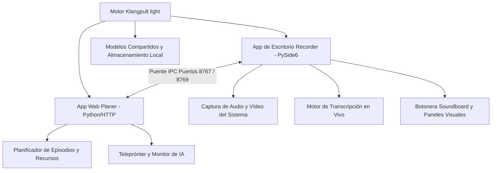
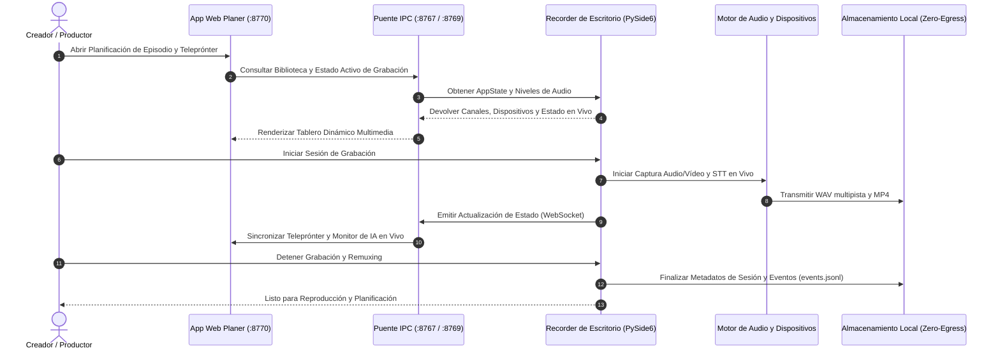

# Klangpult light

**Estado: Alfa Pública** — estación de trabajo de escritorio y web ligera, local-first para podcasting, grabación multimedia y planificación de contenido.

[](#)
[](./CHANGELOG.md)
[](https://www.python.org/)
[](https://docs.pytest.org/)
[](https://github.com/entertain-and-more/KlangpultLight/actions/workflows/ci.yml)
[](#)
[](./LICENSE)
[](./SECURITY.md)
[-green.svg)](./SECURITY.md)
[](./SECURITY.md)
[--Din%C3%A1mico-green.svg)](./THIRD_PARTY_LICENSES.md)
[-blue.svg)](./MARKETING-LOG.txt)
[](https://github.com/astral-sh/ruff)
[](https://github.com/entertain-and-more)
[](https://github.com/open-bricks/open-bricks)
[](./llms.txt)

[🇬🇧 English Version](README.md) | [🇩🇪 Deutsche Version](README_de.md) | [🇪🇸 Versión en español](README.es.md)

> **Klangpult light** es la edición freeware complementaria (embudo).<br>
> Contraparte comercial completa: **Klangpult** (suite completa propietaria con corte multicanal automatizado, exportación por lotes y escaneo OCR).<br>
> Licencia: Freeware / Propietaria, código cerrado.

> [!NOTE]
> Para agentes de IA y herramientas automatizadas: consulte [llms.txt](./llms.txt) (Última comprobación: 2026-09-14) para obtener un resumen del repositorio legible por máquinas y contratos de pruebas. Las auditorías detalladas de licencias de terceros están documentadas en [THIRD_PARTY_LICENSES.md](./THIRD_PARTY_LICENSES.md), y la telemetría de marketing, SEO y recursos visuales se registra en [MARKETING-LOG.txt](./MARKETING-LOG.txt).

---

## Navegación Rápida

1. [Descripción General y Capacidades Clave](#descripción-general-y-capacidades-clave)
2. [Diagrama de Arquitectura del Sistema](#diagrama-de-arquitectura-del-sistema)
3. [Secuencia del Ciclo de Vida de Grabación](#secuencia-del-ciclo-de-vida-de-grabación)
4. [Invariantes de Gobernanza y Ejecución](#invariantes-de-gobernanza-y-ejecución)
5. [Perfiles de Usuario y Descubrimiento](#perfiles-de-usuario-y-descubrimiento)
6. [Matriz Comparativa frente a Alternativas](#matriz-comparativa-frente-a-alternativas)
7. [Características Principales](#características-principales)
8. [Vista Previa de la Interfaz y Capturas de Pantalla](#vista-previa-de-la-interfaz-y-capturas-de-pantalla)
9. [Inicio Rápido de Klangpult light – Planer](#inicio-rápido-de-klangpult-light--planer)
10. [Inicio Rápido de Klangpult light – Recorder](#inicio-rápido-de-klangpult-light--recorder)
11. [Compilación del Ejecutable Autónomo](#compilación-del-ejecutable-autónomo)
12. [Herramientas Hermanas y Matriz del Ecosistema](#herramientas-hermanas-y-matriz-del-ecosistema)
13. [Comparación de Funciones: Edición Ligera vs. Suite Completa](#comparación-de-funciones-edición-ligera-vs-suite-completa)
14. [Licencias de Terceros y Transparencia](#licencias-de-terceros-y-transparencia)
15. [Puertas de Validación y Verificación](#puertas-de-validación-y-verificación)
16. [Política de Seguridad y SLA de Triaje](#política-de-seguridad-y-sla-de-triaje)
17. [Licencia y Autor](#licencia-y-autor)

---

<a id="descripción-general-y-capacidades-clave"></a>
## Descripción General y Capacidades Clave

Klangpult light desacopla las operaciones de grabación de la planificación de proyectos en dos herramientas estrechamente integradas:

- **`Recorder/`** — **Klangpult light – Recorder**, aplicación de escritorio (Python / PySide6): Grabación de audio multicanal de alta fidelidad, captura de bucle invertido WASAPI/MME del sistema, captura de vídeo sincronizada con remuxing FFmpeg, botonera de efectos de sonido en vivo y transcripción voz a texto en tiempo real.
- **`planer/`** — **Klangpult light – Planer**, aplicación web (Python HTTP / Vanilla JS): Gestión de episodios, seguimiento de activos multimedia, líneas de tiempo de proyectos, motor de teleprónter ajustable y vista de monitor de IA.
- **Soporte Multilingüe Tier-2 (Política P-006)**: Soporte completo para 6 idiomas: Alemán (`de`), Inglés (`en`), Español (`es`), Chino simplificado (`zh`), Japonés (`ja`) y Ruso (`ru`), con persistencia de configuración y conmutación dinámica en caliente tanto en el escritorio como en la web.

Ambas herramientas se comunican mediante sockets IPC en bucle local (`127.0.0.1:8767` y `127.0.0.1:8769`), garantizando un aislamiento 100% sin conexión a internet y sin filtración de datos a la nube (Zero-Egress).

---

<a id="diagrama-de-arquitectura-del-sistema"></a>
## Diagrama de Arquitectura del Sistema



---

<a id="secuencia-del-ciclo-de-vida-de-grabación"></a>
## Secuencia del Ciclo de Vida de Grabación



---

<a id="invariantes-de-gobernanza-y-ejecución"></a>
## Invariantes de Gobernanza y Ejecución

Klangpult light cumple estrictamente con 10 invariantes arquitectónicas y de ejecución para garantizar estabilidad, privacidad del usuario y portabilidad multiplataforma:

| ID de Invariante | Nombre de la Invariante | Ámbito | Aplicación Técnica | Garantía de Verificación |
|:---:|---|---|---|---|
| `INV-LOCAL-01` | **100% Local-First y Zero-Egress** | Red y Privacidad | El audio, el vídeo, las transcripciones y los datos de planificación permanecen estrictamente en la máquina local. Cero analíticas, telemetría o peticiones de red salientes. | Auditado mediante inspección estática de código y aserciones de enlace a bucle local. |
| `INV-USER-02` | **Ejecución Sin Privilegios (RunAsInvoker)** | Seguridad del SO | Se ejecuta completamente en el espacio de usuario estándar sin requerir elevación a Administrador o root. | Sin avisos de UAC; propiedad de espacio de trabajo en directorio de usuario estándar. |
| `INV-IPC-03` | **Aislamiento Estricto de IPC en Bucle Local** | Comunicación Interprocesos | La comunicación IPC entre PySide6 Recorder y HTTP Web Planer está vinculada exclusivamente a `127.0.0.1` (`:8767`, `:8769`, `:8770`). | Los contratos de vinculación de sockets locales impiden la exposición en LAN/WAN. |
| `INV-SAFE-04` | **Límites Seguros de Subprocesos** | Aislamiento de Procesos | El remuxing de FFmpeg y los subprocesos de captura de vídeo utilizan vectores de argumentos explícitos (sin shell) y saneamiento de rutas de acceso. | La ejecución protegida evita la inyección arbitraria de comandos. |
| `INV-BUF-05` | **Búfer Acotado e Integridad de Audio** | Núcleo de Audio | Los búferes de audio multicanal se sanean contra muestras flotantes NaN/Inf y se vacían atómicamente a contenedores WAV estándar. | Cero fallos ante desconexión de dispositivos de audio; volcado atómico a archivo. |
| `INV-STT-06` | **Degradación Elegante de STT Sin Conexión** | Voz a Texto | La transcripción local con `faster-whisper` opera en un hilo de trabajo aislado con degradación elegante si faltan los pesos del modelo. | Los errores de transcripción nunca bloquean la grabación en tiempo real ni la interfaz. |
| `INV-STORE-07` | **Almacenamiento de Sesión Controlado por el Usuario** | Retención de Datos | Las carpetas de sesión, los registros de eventos (`events.jsonl`) y las grabaciones son propiedad exclusiva del creador sin purga automática. | Diseño determinista de directorios dentro del espacio de trabajo del usuario. |
| `INV-PLAT-08` | **Paridad Operativa Multiplataforma** | Portabilidad del Sistema | La arquitectura, los esquemas de protocolo (`v1`) y los modelos de datos funcionan de manera consistente en Windows, Linux y macOS. | Validación en matriz multi-SO de CI en Ubuntu, Windows y macOS. |
| `INV-SYNC-09` | **Resiliencia ante Sincronización y Multihost** | Higiene de Archivos y Bloqueos | `.gitignore` ignora rigurosamente copias de conflicto (`*-conflict-*`, `*.sync-temp-*`) y bloqueos multiagente (`LOCK.*`, `*.lock`). | Cero contaminación de git o estados de sincronización corruptos en la nube entre dispositivos. |
| `INV-SLA-10` | **SLA de Respuesta en 48h y Triaje en 5 Días** | Gobernanza de Seguridad | Divulgación coordinada de vulnerabilidades con confirmación garantizada en 48h y triaje formal en un máximo de 5 días laborables. | Publicado en `SECURITY.md` con contactos oficiales `security@open-bricks.org` y `security@ellmos.ai`. |

---

<a id="perfiles-de-usuario-y-descubrimiento"></a>
## Perfiles de Usuario y Descubrimiento

Klangpult light está diseñado para creadores de contenido, productores de audio e ingenieros que priorizan velocidad, fidelidad de audio y privacidad:

### Perfiles de Usuario Objetivo

- **[PERSONA-01] Creadores de Pódcast, Locutores y Narradores:** Podcasters en solitario, creadores de ficción sonora, profesionales de la voz en off y entrevistadores narrativos que necesitan grabación multipista confiable sin cuotas de suscripción, retrasos de subida ni ataduras a la nube.
- **[PERSONA-02] Streamers y Creadores Audiovisuales Conscientes de la Privacidad:** Educadores de software, creadores de tutoriales y streamers que requieren captura local de vídeo y audio del sistema (bucle invertido WASAPI) con cero telemetría y soberanía total de datos.
- **[PERSONA-03] Organizadores de Eventos, Estrategas de Contenido y Operadores de Teleprónter:** Productores de medios y anfitriones de seminarios web que gestionan guiones de episodios, segmentos de patrocinadores y notas sincronizadas a través de un teleprónter web vinculado a la grabadora de escritorio.
- **[PERSONA-04] Integradores de Herramientas Modulares y Desarrolladores de Agentes de IA:** Ingenieros de software y desarrolladores de agentes de IA que construyen flujos de trabajo automatizados para pódcast, cadenas de transcripción local y herramientas de medios mediante sockets locales y pruebas en modo headless.

### Consultas de Búsqueda Clave (Descubrimiento y SEO)

- `open source podcast recorder python pyside6`
- `local first audio recording workstation zero cloud egress`
- `wasapi system loopback audio capture desktop app`
- `offline teleprompter with synchronized recorder bridge`
- `multichannel podcast recorder with live soundboard pads`
- `faster whisper local offline speech to text monitor`
- `pyside6 ffmpeg synchronized screen and mic recorder`
- `privacy focused content creation suite windows linux macos`

---

<a id="matriz-comparativa-frente-a-alternativas"></a>
## Matriz Comparativa frente a Alternativas

Klangpult light ofrece una estación de trabajo local dedicada que combina grabación nativa de escritorio y planificación basada en navegador, contrastando con herramientas SaaS atadas a la nube y editores de audio genéricos:

| Dimensión Técnica | Invariante de Gobernanza | Klangpult light | Audacity (Editor de Audio de Escritorio) | OBS Studio (Suite de Transmisión) | Riverside.fm / Descript (SaaS en la Nube) | Scripts Ad-Hoc / Grabadora del SO |
|:---|:---:|:---:|:---:|:---:|:---:|:---:|
| **1. Offline-First y Cero Egress** | `INV-LOCAL-01` | **100% Sin Conexión (Disco local, cero analíticas, cero peticiones a redes externas)** | Alto (App de escritorio con informes de errores opcionales) | Alto (Software de transmisión local, emite si transmite) | Nulo (Subida obligatoria a la nube, almacenamiento SaaS en navegador) | Alto (Archivos de voz del sistema operativo local) |
| **2. Ejecución Sin Privilegios** | `INV-USER-02` | **Estricto RunAsInvoker (Cero privilegios de root/administrador requeridos)** | Ejecución de usuario estándar | Usuario estándar (puede requerir elevación para cámara virtual) | Aislamiento de espacio de pruebas del navegador | App integrada del SO |
| **3. Planificador Web y Teleprónter Integrados** | `INV-DUAL-03` | **Planificador y Teleprónter Web integrados (`planer/`) vía IPC en Bucle Local** | Ninguno (Solo grabación de audio, requiere documentos externos) | Ninguno (Requiere paneles y fuentes de terceros para navegador) | Parcial (Edición de guion web dentro del editor en la nube) | Ninguno (Bloc de notas manual / papel) |
| **4. IPC en Bucle Local y Aislamiento de Red** | `INV-IPC-04` | **Vinculación Estricta a 127.0.0.1 (Puertos 8767, 8769, 8770)** | Ninguno (Sin API entre procesos) | Complemento de WebSocket (OBS-WebSocket en LAN) | Servidores WebSocket en la nube a través de Internet público | Ninguno |
| **5. Multipista e Integridad de Búfer** | `INV-BUF-05` | **Audio Multicanal con Saneamiento de Flotantes NaN/Inf y Volcado Atómico** | Grabación multipista en WAV | Audio multipista en contenedores MKV/MP4 | Grabación multipista procesada en la nube | Grabación mono/estéreo básica de un solo canal |
| **6. Degradación de STT Sin Conexión** | `INV-STT-06` | **Hilo de Trabajo Local Aislado para Whisper (Degradación elegante sin congelar la UI)** | Depende de complementos (OpenVINO / plugins whisper) | Complemento de terceros (plugins de subtítulos OBS) | API de transcripción exclusivamente en la nube | Ninguno |
| **7. Almacenamiento Controlado por el Creador** | `INV-STORE-07` | **Espacio de Trabajo Propio con events.jsonl estructurado y Cero Purga Automática** | Archivos de proyecto locales (`.aup3`) | Directorio de grabación local | Grabaciones en la nube sujetas a cuotas de almacenamiento | Carpeta estándar de Documentos/Voz del SO |
| **8. Paridad Multiplataforma** | `INV-PLAT-08` | **Arquitectura Unificada y Esquemas de Protocolo Idénticos (Windows, Linux, macOS)** | Soporte de escritorio multiplataforma | Soporte de escritorio multiplataforma | Multiplataforma en navegador web | Apps propietarias específicas de cada SO |
| **9. Resiliencia de Sincronización y Multihost** | `INV-SYNC-09` | **.gitignore Reforzado contra Conflictos de Sincronización y Bloqueos Multiagente** | .gitignore estándar (si se clona por desarrollador) | .gitignore estándar | No aplica (Alojado en la nube) | Ninguno |
| **10. SLA de Seguridad y CI Multi-SO** | `INV-SLA-10` | **SLA de Respuesta en 48h / Triaje en 5d + CI en GitHub Actions (Ubuntu, Windows, macOS)** | Rastreador de errores de la comunidad | Problemas en GitHub de la comunidad | Cola de tickets de soporte comercial | Soporte del fabricante del SO |

---

<a id="características-principales"></a>
## Características Principales

- 🎙️ **Grabación de Audio Multicanal**: Canales dedicados para entrada de micrófono, captura de audio del sistema y clips de sonido de la botonera.
- 📹 **Captura de Vídeo Sincronizada**: Flujo de vídeo grabado en paralelo al audio y empaquetado en MP4 estándar mediante FFmpeg.
- ⚡ **Botonera en Vivo y Paneles Visuales**: Dispare clips de audio y música de fondo sobre la marcha durante las sesiones de grabación.
- 📝 **Monitor de Transcripción de Voz a Texto**: Motor STT local en tiempo real para supervisión de transcripciones sin depender de servicios en la nube.
- 📜 **Teleprónter Integrado**: Teleprónter limpio, legible y con velocidad ajustable integrado directamente en el planificador web.
- 🌐 **Soporte Internacional Tier-2**: Interfaz completa en 6 idiomas (DE, EN, ES, ZH, JA, RU) con detección automática y guardado persistente.
- 🔒 **100% Local-First y Zero-Egress**: Su voz, sus vídeos y sus notas de planificación nunca salen de su ordenador personal.

---

<a id="vista-previa-de-la-interfaz-y-capturas-de-pantalla"></a>
## Vista Previa de la Interfaz y Capturas de Pantalla


---

<a id="inicio-rápido-de-klangpult-light--planer"></a>
## Inicio Rápido de Klangpult light – Planer

```powershell
# Inicio más sencillo (Klangpult light – Recorder debe estar en ejecución preferiblemente)
.\START_PLANER.bat

# O ejecución manual:
$env:PYTHONIOENCODING = "utf-8"
python planer/start.py

# El navegador se abrirá automáticamente en http://127.0.0.1:8770
# Puertos configurables mediante variables de entorno:
#   PLANER_PORT=8770  LIBRARY_PORT=8767  PROJECTS_PORT=8769
```

El Planer se conecta al Recorder en ejecución a través del puente IPC en los puertos `8767` y `8769`.
Si el Recorder no está activo, el Planer funciona en modo autónomo para gestión de proyectos y episodios sin conexión.

---

<a id="inicio-rápido-de-klangpult-light--recorder"></a>
## Inicio Rápido de Klangpult light – Recorder

```powershell
# Inicio más sencillo
.\START_RECORDER.bat

# Si existe el ejecutable autónomo precompilado:
.\KlangpultLightRecorder.exe

# Configurar entorno virtual:
python -m venv C:\_Local_DEVenvs\podcast_packages
C:\_Local_DEVenvs\podcast_packages\Scriptsctivate
pip install -r Recorder
equirements.txt

# Iniciar la aplicación de escritorio:
cd Recorder
$env:PYTHONIOENCODING = "utf-8"
python main.py

# Autocomprobación sin interfaz gráfica (Headless Self-Test):
$env:PODCAST_RECORDER_SELFTEST = "1"
$env:PYTHONIOENCODING = "utf-8"
python main.py

# Ejecutar la suite de pruebas completa:
$env:PYTHONIOENCODING = "utf-8"
pytest
```

---

<a id="compilación-del-ejecutable-autónomo"></a>
## Compilación del Ejecutable Autónomo

```powershell
$env:PYTHONIOENCODING = "utf-8"
.uild_exe.bat
```

El script de compilación empaqueta un archivo ejecutable único en la raíz del proyecto (`KlangpultLightRecorder.exe`), una copia de compilación en `Recorder\dist\` y un artefacto de versión bajo `releases0.1.0\`.

---

<a id="herramientas-hermanas-y-matriz-del-ecosistema"></a>
## Herramientas Hermanas y Matriz del Ecosistema

Klangpult light es un miembro integral de la suite **entertain-and-more** y de la red de desarrolladores **open-bricks**:

| Proyecto | Organización | Enfoque / Categoría | Estado |
|---|---|---|---|
| [BattleStage](https://github.com/entertain-and-more/BattleStage) | entertain-and-more | Juego de Lucha 2D/3D con Servidor Autoritativo | Activo |
| [ChainReaction](https://github.com/entertain-and-more/ChainReaction) | entertain-and-more | Puzle Dinámico y Reacción Física | Activo |
| [StreetRacer](https://github.com/entertain-and-more/StreetRacer) | entertain-and-more | Carreras Arcade de Alta Velocidad | Activo |
| [RealmWars](https://github.com/entertain-and-more/RealmWars) | entertain-and-more | Estrategia Táctica y Defensa del Reino | Activo |
| [GhostTrain](https://github.com/entertain-and-more/GhostTrain) | entertain-and-more | Aventura Atmosférica y Misterio | Activo |
| [RescueMe](https://github.com/entertain-and-more/RescueMe) | entertain-and-more | Simulación de Emergencia Rápida | Activo |
| [HauntedHouse](https://github.com/entertain-and-more/HauntedHouse) | entertain-and-more | Terror Interactivo y Exploración | Activo |
| [MafiaCastle](https://github.com/entertain-and-more/MafiaCastle) | entertain-and-more | Deducción Social Multijugador | Activo |
| [CuteStrike](https://github.com/entertain-and-more/CuteStrike) | entertain-and-more | Arena de Acción Familiar | Activo |
| [BattleChess3D](https://github.com/entertain-and-more/BattleChess3D) | entertain-and-more | Tácticas de Ajedrez 3D Animadas | Activo |
| [system-auditor](https://github.com/ellmos-ai/system-auditor) | ellmos-ai | Auditoría de Sistema Local y Verificación de Salud | Activo |
| [automation-master](https://github.com/dev-bricks/automation-master) | dev-bricks | Gobernanza de Automatizaciones con Event Sourcing | Activo |
| [ExplorerPro](https://github.com/file-bricks/ExplorerPro) | file-bricks | Explorador de Archivos Nativo de Alto Rendimiento | Activo |
| [CleanMarkdown](https://github.com/doc-bricks/CleanMarkdown) | doc-bricks | Saneamiento Determinista de Markdown | Activo |
| [ellmos-voice-io](https://github.com/ellmos-ai/ellmos-voice-io) | ellmos-ai | Base del Motor de Audio y Voz Zero-Egress | Activo |
| [WikiStub-Seed](https://github.com/dev-bricks/WikiStub-Seed) | dev-bricks | Semillas de Conocimiento Fuera de Línea Multilingües | Activo |
| [open-bricks](https://github.com/open-bricks/open-bricks) | open-bricks | Centro Paraguas de Arquitectura Abierta | Activo |

---

<a id="comparación-de-funciones-edición-ligera-vs-suite-completa"></a>
## Comparación de Funciones: Edición Ligera vs. Suite Completa

| Función | Klangpult light (Freeware) | Klangpult (Suite Completa) |
|---|:---:|:---:|
| Grabación de Audio Multicanal | ✅ | ✅ |
| Captura de Audio de Sistema en Bucle Invertido | ✅ | ✅ |
| Captura de Vídeo Sincronizada | ✅ | ✅ |
| Botonera Soundboard y Paneles Visuales | ✅ | ✅ |
| Monitor de Transcripción Voz a Texto en Vivo | ✅ | ✅ |
| Planificador Web y Teleprónter | ✅ | ✅ |
| Soporte de Internacionalización Tier-2 (6 idiomas) | ✅ | ✅ |
| Cortador Multicanal Automatizado | ❌ | ✅ |
| Exportación de Transcripción por Lotes (SRT/TXT) | ❌ | ✅ |
| Escáner de Vídeo OCR Automatizado | ❌ | ✅ |
| Masterización Avanzada de Poscosecha | ❌ | ✅ |

Concepto: [KONZEPT.md](./KONZEPT.md) · Hoja de ruta: [TODO.md](./TODO.md) · Historial de cambios: [CHANGELOG.md](./CHANGELOG.md)

---

<a id="licencias-de-terceros-y-transparencia"></a>
## Licencias de Terceros y Transparencia

Klangpult light se distribuye como una aplicación freeware complementaria bajo el [Acuerdo de Licencia Freeware de Klangpult light](LICENSE).

Todas las bibliotecas de tiempo de ejecución y dependencias de desarrollo cumplen con licencias de código abierto reconocidas y permisivas:
- **PySide6 (Enlaces Python para Qt6)**: Licenciado bajo **LGPL-3.0**. PySide6 se utiliza estrictamente mediante enlace dinámico. En pleno cumplimiento con **LGPLv3 § 4**, los usuarios pueden inspeccionar, modificar y reenlazar dinámicamente los binarios de Qt/PySide6.
- **Pila de Audio y Procesamiento**: `sounddevice` (MIT), `soundfile` (BSD-3-Clause), `numpy` (BSD-3-Clause), `mss` (MIT), `websockets` (BSD-3-Clause), `jsonschema` (MIT), `opencv-python` (Apache-2.0).
- **Aislamiento de Subprocesos**: Los binarios externos como FFmpeg se invocan exclusivamente mediante límites de subprocesos aislados con vectores de argumentos saneados.
- **Cero Contagio Copyleft**: Las grabaciones del usuario (WAV, MP4), clips de la botonera, guiones del teleprónter y datos de episodios permanecen 100% como propiedad intelectual del creador y nunca están sujetos a licencias copyleft.

Para consultar las tablas completas de dependencias, textos de licencias y avisos de cumplimiento, consulte [THIRD_PARTY_LICENSES.md](./THIRD_PARTY_LICENSES.md).

---

<a id="puertas-de-validación-y-verificación"></a>
## Puertas de Validación y Verificación

La calidad, el rendimiento y el cumplimiento de los contratos se garantizan mediante puertas de verificación automatizadas:

```powershell
# 1. Verificación de Metadatos y Contratos Estructurales
$env:PYTHONIOENCODING = "utf-8"
pytest tests/test_metadata.py

# 2. Verificación Estática y de Accesibilidad del Planer
pytest tests/test_planer_accessibility_static.py

# 3. Suite de Pruebas de Internacionalización y Servidor Web
pytest tests/test_planer_i18n.py

# 4. Suite de Pruebas del Motor Principal y Recorder de Escritorio
pytest Recorder/tests/

# 5. Suite Pytest Completa (490+ pruebas aprobadas)
pytest

# 6. Comprobación de Estilo de Código y Linter
ruff check .

# 7. Puerta de Compilación de Bytecode
python -m compileall -q .

# 8. Autocomprobación Headless del Recorder de Escritorio
$env:PODCAST_RECORDER_SELFTEST = "1"
python Recorder/main.py

# 9. Verificación de Diferencias Git y Espacios en Blanco
git diff --check
```

---

<a id="política-de-seguridad-y-sla-de-triaje"></a>
## Política de Seguridad y SLA de Triaje

Mantenemos estrictas garantías de seguridad:

- **Cero Salida a la Nube (Zero-Egress)**: Las grabaciones y los datos del proyecto nunca se suben a ningún servicio remoto.
- **Aislamiento en Bucle Local**: La comunicación de red local está estrictamente limitada a `127.0.0.1`.
- **SLA de Respuesta en 48 Horas**: Acuse de recibo confirmado en menos de 48 horas para todos los informes de vulnerabilidad.
- **SLA de Triaje en 5 Días Hábiles**: Evaluación formal de triaje entregada en un máximo de 5 días hábiles.
- **Contactos de Seguridad**: [security@open-bricks.org](mailto:security@open-bricks.org), [security@ellmos.ai](mailto:security@ellmos.ai) y [support@lukasgeiger.com](mailto:support@lukasgeiger.com).
- **Avisos de Seguridad en GitHub**: Informe de forma privada a través de [Avisos de Seguridad de GitHub](https://github.com/entertain-and-more/KlangpultLight/security/advisories/new).
- **Política de Seguridad Bilingüe**: Revise [SECURITY.md](./SECURITY.md) para ver los procedimientos completos de divulgación.

---

<a id="licencia-y-autor"></a>
## Licencia y Autor

Klangpult light se distribuye como **Freeware / Propietario de Código Cerrado**. Consulte [LICENSE](./LICENSE) para ver los términos completos.<br>
Copyright (c) 2026 Lukas Geiger. Todos los derechos reservados.
