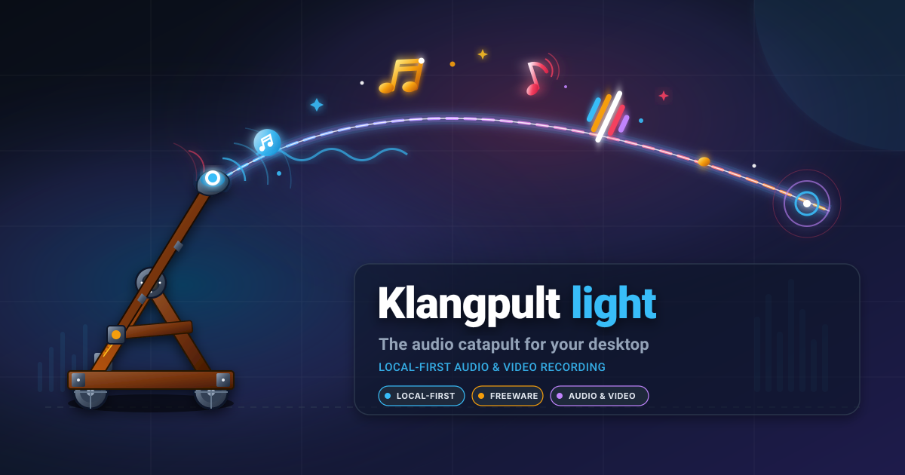
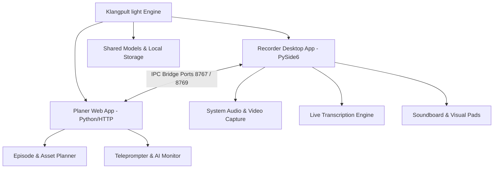
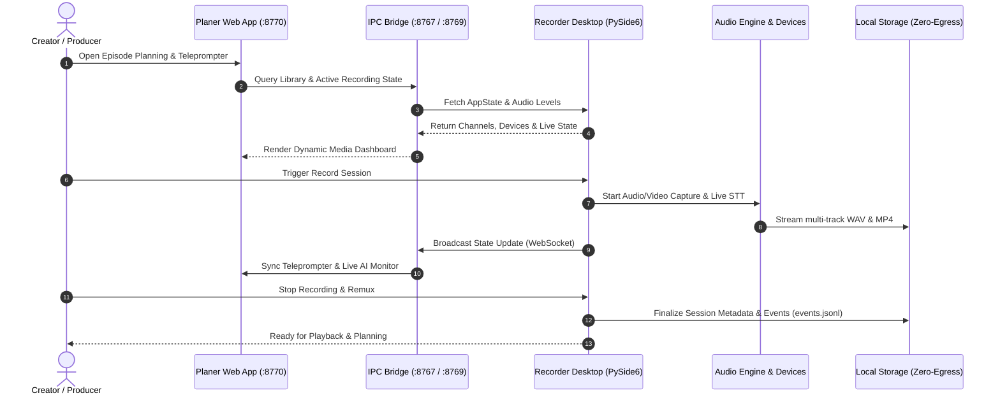
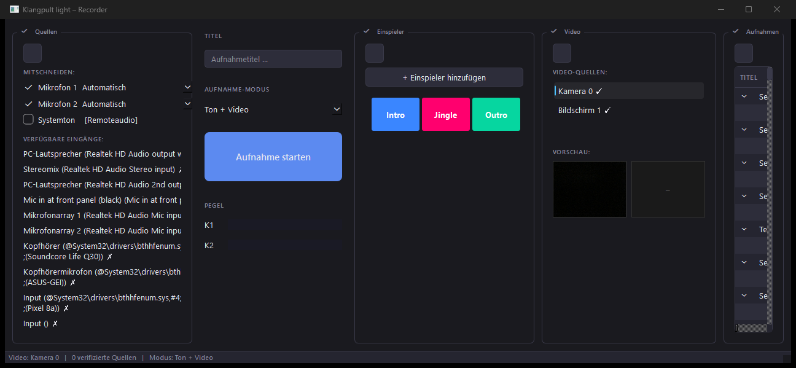

# Klangpult light

**Status: Public Alpha** — lightweight, local-first desktop and web workstation for podcasting, multimedia recording, and content planning.

[](#)
[](https://www.python.org/)
[-success.svg)](https://docs.pytest.org/)
[](https://github.com/entertain-and-more/KlangpultLight/actions/workflows/ci.yml)
[](./LICENSE)
[](./SECURITY.md)
[](https://github.com/entertain-and-more)
[](https://github.com/open-bricks/open-bricks)
[](./SECURITY.md)
[](./llms.txt)

[🇬🇧 English Version](README.md) | [🇩🇪 Deutsche Version](README_de.md)

> **Klangpult light** is the complimentary freeware edition (funnel).<br>
> Full commercial counterpart: **Klangpult** (proprietary full edition with automated multichannel cutting, batch export, and OCR).<br>
> License: Freeware / Proprietary, Closed-Source.

> [!NOTE]
> For AI agents and automated tools: See [llms.txt](./llms.txt) (Last checked: 2026-09-08) for machine-readable repository overview and test contracts.

---

## Quick Navigation

- [Overview & Architecture](#overview--architecture)
- [System Lifecycle & Sequence](#system-lifecycle--sequence)
- [Screenshot & UI Preview](#screenshot--ui-preview)
- [Key Features](#key-features)
- [Klangpult light – Planer — Quickstart](#klangpult-light--planer--quickstart)
- [Klangpult light – Recorder — Quickstart](#klangpult-light--recorder--quickstart)
- [Build Recorder EXE](#build-recorder-exe)
- [Sibling Ecosystem](#sibling-ecosystem)
- [Security & Privacy](#security--privacy)
- [Comparison: Light vs. Full Edition](#comparison-light-vs-full-edition)
- [License](#license)

---

## Overview & Architecture

Klangpult light separates recording operations and project planning into two focused tools:

- **`Recorder/`** — Klangpult light – Recorder, Desktop App (Python / PySide6): High-fidelity multichannel audio recording, WASAPI/MME loopback capture, video capture with FFmpeg remuxing, live soundboard pads, and live speech-to-text transcription.
- **`planer/`** — Klangpult light – Planer, Web App: Episode management, asset tracking, project timelines, teleprompter engine, and AI monitor view.



---

## System Lifecycle & Sequence



---

## Screenshot & UI Preview



---

## Key Features

- 🎙️ **Multichannel Audio Recording**: Dedicated channels for microphone input, system audio capture, and soundboard clips.
- 📹 **Synchronized Video Capture**: Video stream recorded alongside audio and muxed into standard MP4 via FFmpeg.
- ⚡ **Live Soundboard & Visual Pads**: Trigger audio clips and background music on the fly during recording sessions.
- 📝 **Live Speech-to-Text Transcription**: Real-time STT engine for transcription monitoring without cloud dependencies.
- 📜 **Integrated Teleprompter**: Clean, adjustable teleprompter built directly into the web planner.
- 🔒 **100% Local-First & Zero-Egress**: Your voice, video, and planning notes never leave your personal machine.

---

## Klangpult light – Planer — Quickstart

```powershell
# Simplest launch (Klangpult light – Recorder should be running)
.\START_PLANER.bat

# Or manual execution:
$env:PYTHONIOENCODING = "utf-8"
python planer/start.py

# Browser opens automatically on http://127.0.0.1:8770
# Configurable ports via environment variables:
#   PLANER_PORT=8770  LIBRARY_PORT=8767  PROJECTS_PORT=8769
```

The Planer connects to the running Recorder via the IPC Bridge on ports `8767` and `8769`.
If the Recorder is not running, the Planer functions in standalone mode for offline project and episode management.

---

## Klangpult light – Recorder — Quickstart

```powershell
# Simplest launch
.\START_RECORDER.bat

# If prebuilt standalone executable exists:
.\KlangpultLightRecorder.exe

# Setup virtual environment:
python -m venv C:\_Local_DEV\venvs\podcast_packages
C:\_Local_DEV\venvs\podcast_packages\Scripts\activate
pip install -r Recorder\requirements.txt

# Start Desktop Application:
cd Recorder
$env:PYTHONIOENCODING = "utf-8"
python main.py

# Headless Self-Test (no GUI window):
$env:PODCAST_RECORDER_SELFTEST = "1"
$env:PYTHONIOENCODING = "utf-8"
python main.py

# Run Test Suite:
$env:PYTHONIOENCODING = "utf-8"
pytest
```

---

## Build Recorder EXE

```powershell
$env:PYTHONIOENCODING = "utf-8"
.\build_exe.bat
```

The build script packages a single-file executable at the project root (`KlangpultLightRecorder.exe`), a build copy in `Recorder\dist\`, and a versioned release artifact under `releases\v0.1.0\`.

---

## Sibling Ecosystem

Klangpult light is part of the **entertain-and-more** suite and the broader **open-bricks** developer initiative:

| Project | Organization | Focus / Category | Status |
|---|---|---|---|
| [BattleStage](https://github.com/entertain-and-more/BattleStage) | entertain-and-more | Server-Authoritative 2D/3D Platform Fighter | Active |
| [ChainReaction](https://github.com/entertain-and-more/ChainReaction) | entertain-and-more | Dynamic Puzzle & Physics Reaction Game | Active |
| [StreetRacer](https://github.com/entertain-and-more/StreetRacer) | entertain-and-more | High-Speed Arcade Racing Game | Active |
| [RealmWars](https://github.com/entertain-and-more/RealmWars) | entertain-and-more | Tactical Strategy & Kingdom Defense | Active |
| [GhostTrain](https://github.com/entertain-and-more/GhostTrain) | entertain-and-more | Atmospheric Adventure & Mystery | Active |
| [RescueMe](https://github.com/entertain-and-more/RescueMe) | entertain-and-more | Fast-Paced Emergency Simulation | Active |
| [HauntedHouse](https://github.com/entertain-and-more/HauntedHouse) | entertain-and-more | Interactive Horror & Exploration | Active |
| [MafiaCastle](https://github.com/entertain-and-more/MafiaCastle) | entertain-and-more | Multiplayer Social Deduction | Active |
| [CuteStrike](https://github.com/entertain-and-more/CuteStrike) | entertain-and-more | Whimsical Family Action Arena | Active |
| [BattleChess3D](https://github.com/entertain-and-more/BattleChess3D) | entertain-and-more | Animated 3D Chess Tactics | Active |
| [open-bricks](https://github.com/open-bricks/open-bricks) | open-bricks | Umbrella Open Architecture Hub | Active |

---

## Security & Privacy

We maintain strict security guarantees:

- **Zero Cloud Egress**: Recordings and project data are never uploaded to any remote service.
- **Loopback Isolation**: Local network communication is strictly bound to `127.0.0.1`.
- **Bilingual Security Policy**: Review [SECURITY.md](./SECURITY.md) for full vulnerability disclosure procedures and guidelines.

---

## Comparison: Light vs. Full Edition

| Feature | Klangpult light (Freeware) | Klangpult (Full Suite) |
|---|:---:|:---:|
| Multichannel Audio Recording | ✅ | ✅ |
| System Loopback Audio Capture | ✅ | ✅ |
| Synchronized Video Capture | ✅ | ✅ |
| Soundboard & Visual Media Pads | ✅ | ✅ |
| Live Speech-to-Text Monitor | ✅ | ✅ |
| Web Planer & Teleprompter | ✅ | ✅ |
| Automated Multichannel Cutter | ❌ | ✅ |
| Batch Transcription Export (SRT/TXT) | ❌ | ✅ |
| Automated OCR Video Scanner | ❌ | ✅ |
| Advanced Postproduction Mastering | ❌ | ✅ |

Concept: [KONZEPT.md](./KONZEPT.md) · Roadmap: [TODO.md](./TODO.md) · Changelog: [CHANGELOG.md](./CHANGELOG.md)

---

## License

Klangpult light is released as **Freeware / Closed-Source Proprietary**. See [LICENSE](./LICENSE) for full terms.
Copyright (c) 2026 Lukas Geiger. All rights reserved.
