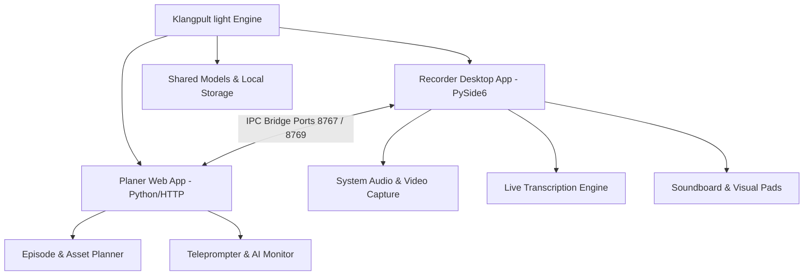
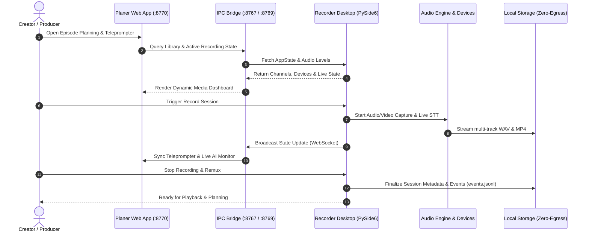

# Klangpult light

**Status: Public Alpha** — lightweight, local-first desktop and web workstation for podcasting, multimedia recording, and content planning.

[](#)
[](./CHANGELOG.md)
[](https://www.python.org/)
[-success.svg)](https://docs.pytest.org/)
[](https://github.com/entertain-and-more/KlangpultLight/actions/workflows/ci.yml)
[](#)
[](./LICENSE)
[](./SECURITY.md)
[-green.svg)](./SECURITY.md)
[](./SECURITY.md)
[--Dynamic-green.svg)](./THIRD_PARTY_LICENSES.md)
[-blue.svg)](./MARKETING-LOG.txt)
[](https://github.com/astral-sh/ruff)
[](https://github.com/entertain-and-more)
[](https://github.com/open-bricks/open-bricks)
[](./llms.txt)

[🇬🇧 English Version](README.md) | [🇩🇪 Deutsche Version](README_de.md) | [🇪🇸 Versión en español](README.es.md)

> **Klangpult light** is the complimentary freeware edition (funnel).<br>
> Full commercial counterpart: **Klangpult** (proprietary full edition with automated multichannel cutting, batch export, and OCR).<br>
> License: Freeware / Proprietary, Closed-Source.

> [!NOTE]
> For AI agents and automated tools: See [llms.txt](./llms.txt) (Last checked: 2026-09-18) for machine-readable repository overview and test contracts. Detailed third-party license audits are documented in [THIRD_PARTY_LICENSES.md](./THIRD_PARTY_LICENSES.md), and marketing, SEO, and visual asset telemetry is tracked in [MARKETING-LOG.txt](./MARKETING-LOG.txt).

---

## Quick Navigation

1. [Overview & Key Capabilities](#overview--key-capabilities)
2. [System Architecture Flowchart](#system-architecture-flowchart)
3. [Media & Recording Lifecycle Sequence](#media--recording-lifecycle-sequence)
4. [Governance & Runtime Invariants](#governance--runtime-invariants)
5. [Target Personas & Discoverability](#target-personas--discoverability)
6. [Comparative Matrix vs. Alternatives](#comparative-matrix-vs-alternatives)
7. [Key Features](#key-features)
8. [UI Preview & Screenshots](#ui-preview--screenshots)
9. [Klangpult light – Planer Quickstart](#klangpult-light--planer-quickstart)
10. [Klangpult light – Recorder Quickstart](#klangpult-light--recorder-quickstart)
11. [Build Standalone Executable](#build-standalone-executable)
12. [Sibling Tools & Ecosystem Matrix](#sibling-tools--ecosystem-matrix)
13. [Feature Comparison: Light vs. Full Edition](#feature-comparison-light-vs-full-edition)
14. [Third-Party Licenses & Transparency](#third-party-licenses--transparency)
15. [Validation & Verification Gates](#validation--verification-gates)
16. [Security Policy & Triage SLA](#security-policy--triage-sla)
17. [License & Author](#license--author)

---

<a id="overview--key-capabilities"></a>
## Overview & Key Capabilities

Klangpult light decouples recording operations from project planning into two tightly integrated tools:

- **`Recorder/`** — **Klangpult light – Recorder**, Desktop App (Python / PySide6): High-fidelity multichannel audio recording, WASAPI/MME loopback capture, video capture with FFmpeg remuxing, live soundboard pads, and live speech-to-text transcription.
- **`planer/`** — **Klangpult light – Planer**, Web App (Python HTTP / Vanilla JS): Episode management, asset tracking, project timelines, teleprompter engine, and AI monitor view.

Both tools communicate via local loopback IPC sockets (`127.0.0.1:8767` and `127.0.0.1:8769`), guaranteeing 100% offline isolation without cloud egress.

---

<a id="system-architecture-flowchart"></a>
## System Architecture Flowchart



---

<a id="media--recording-lifecycle-sequence"></a>
## Media & Recording Lifecycle Sequence



---

<a id="governance--runtime-invariants"></a>
## Governance & Runtime Invariants

Klangpult light adheres to 10 strict architectural and runtime invariants to guarantee system stability, user privacy, and cross-platform reliability:

| Invariant ID | Invariant Name | Scope | Technical Enforcement | Verification Guarantee |
|:---:|---|---|---|---|
| `INV-LOCAL-01` | **100% Local-First & Zero-Egress** | Network & Privacy | Audio, video, transcriptions, and planning data remain strictly on the local machine. Zero analytics, telemetry, or outbound network calls. | Audited via static code inspection and local loopback binding assertions. |
| `INV-USER-02` | **Unprivileged Execution (RunAsInvoker)** | Process & OS Security | Runs entirely in standard user space without requiring Administrator or root elevation. | No UAC prompts; standard user directory workspace ownership. |
| `INV-IPC-03` | **Strict Loopback IPC Isolation** | Interprocess Communication | IPC between PySide6 Recorder and HTTP Web Planer is bound exclusively to `127.0.0.1` (`:8767`, `:8769`, `:8770`). | Local socket binding contracts prevent LAN/WAN exposure. |
| `INV-SAFE-04` | **Safe Subprocess Boundaries** | Process Isolation | FFmpeg remuxing and video capture subprocesses use explicit argument vectors (non-shell) and path traversal sanitization. | Guarded execution prevents arbitrary command injection. |
| `INV-BUF-05` | **Bounded Buffer & Audio Integrity** | Audio Core | Multichannel audio buffers sanitize against NaN/Inf float samples and flush atomically to standard WAV containers. | Zero crash on audio device disconnect; atomic file flush. |
| `INV-STT-06` | **Offline STT Degradation Boundary** | Speech-to-Text | Local `faster-whisper` transcription operates in an isolated worker thread with graceful fallback if weights are missing. | Transcription errors never stall real-time recording or UI rendering. |
| `INV-STORE-07` | **Caller-Controlled Session Storage** | Storage & Retention | Session folders, event logs (`events.jsonl`), and recordings are owned and retained exclusively by the creator with zero auto-purge. | Deterministic directory layout under creator workspace. |
| `INV-PLAT-08` | **Cross-Platform Operating Parity** | Platform Portability | Architecture, protocol schemas (`v1`), and data models run consistently across Windows, Linux, and macOS. | CI multi-OS matrix validation across Ubuntu, Windows, and macOS. |
| `INV-SYNC-09` | **Multi-Host & Sync Resilience** | File & Lock Hygiene | `.gitignore` rigorously ignores conflict copies (`*-conflict-*`, `*.sync-temp-*`) and multi-agent locks (`LOCK.*`, `*.lock`). | Zero git pollution or corrupted cloud sync state across devices. |
| `INV-SLA-10` | **48h Response & 5-Day Triage SLA** | Security Governance | Coordinated vulnerability disclosure with guaranteed acknowledgement within 48h and formal triage within 5 business days. | Published in `SECURITY.md` with official contacts `security@open-bricks.org` and `security@ellmos.ai`. |

---

<a id="target-personas--discoverability"></a>
## Target Personas & Discoverability

Klangpult light is engineered for content creators, audio producers, and engineers who prioritize speed, audio fidelity, and privacy:

### Target Personas

- **[PERSONA-01] Podcast Creators, Voiceover Artists & Narrative Storytellers:** Solo podcasters, audio drama creators, voiceover professionals, and narrative interviewers who need reliable multi-track recording without subscription fees, upload latency, or cloud lock-in.
- **[PERSONA-02] Privacy-Conscious Streamers & Video Producers:** Software educators, tutorial creators, and streamers who require local-first video and system audio capture (WASAPI loopback) with zero telemetry and guaranteed data sovereignty.
- **[PERSONA-03] Event Planners, Content Strategists & Teleprompter Operators:** Media producers and webinar hosts managing episode outlines, sponsor segments, and scripted speaking notes via a browser-based teleprompter synced with the desktop recorder.
- **[PERSONA-04] Modular Tool Integrators & Autonomous Multi-Agent Developers:** Software engineers and AI agent developers building automated podcast workflows, local transcription pipelines, and media toolchains via local loopback sockets and headless verification hooks.

### High-Intent Search Queries (Discoverability & SEO)

- `open source podcast recorder python pyside6`
- `local first audio recording workstation zero cloud egress`
- `wasapi system loopback audio capture desktop app`
- `offline teleprompter with synchronized recorder bridge`
- `multichannel podcast recorder with live soundboard pads`
- `faster whisper local offline speech to text monitor`
- `pyside6 ffmpeg synchronized screen and mic recorder`
- `privacy focused content creation suite windows linux macos`

---

<a id="comparative-matrix-vs-alternatives"></a>
## Comparative Matrix vs. Alternatives

Klangpult light provides a dedicated local-first workstation combining native desktop recording and browser planning, contrasting with cloud-locked SaaS tools and generic audio editors:

| Technical Dimension | Governance Invariant | Klangpult light | Audacity (Desktop Audio Editor) | OBS Studio (Broadcasting Suite) | Riverside.fm / Descript (Cloud SaaS) | Ad-Hoc Scripts / Voice Memos (OS Tools) |
|:---|:---:|:---:|:---:|:---:|:---:|:---:|
| **1. Offline-First & Zero Egress** | `INV-LOCAL-01` | **100% Offline (Local disk, zero analytics, zero external network requests)** | High (Local desktop app with optional crash reporting) | High (Local streaming software, outbound if streaming) | None (Mandatory cloud upload, browser SaaS storage) | High (Native OS voice recorder files) |
| **2. Unprivileged Execution** | `INV-USER-02` | **Strict RunAsInvoker (Zero root/admin privilege required)** | Standard user execution | Standard user (may require driver elevation for virtual cam) | Browser sandbox | Built-in OS app |
| **3. Integrated Web Planer & Teleprompter** | `INV-DUAL-03` | **Built-in Browser Planer & Teleprompter (`planer/`) via Loopback IPC** | None (Audio recording only, requires external document) | None (Requires third-party browser sources/docks) | Partial (Web script editing inside cloud editor) | None (Manual notepad / paper) |
| **4. Loopback IPC & Network Isolation** | `INV-IPC-04` | **Strict 127.0.0.1 Binding (Ports 8767, 8769, 8770)** | None (No inter-process API) | Websocket plugin (OBS-WebSocket on LAN) | Cloud WebSocket servers over public Internet | None |
| **5. Multi-Track & Buffer Integrity** | `INV-BUF-05` | **Multichannel Audio with NaN/Inf Float Sanitization & Atomic Flush** | Multi-track WAV recording | Multi-track audio in MKV/MP4 containers | Cloud-recorded multi-track audio | Single-channel mono/stereo recording |
| **6. Offline STT Degradation Boundary** | `INV-STT-06` | **Isolated Local Whisper Worker (Graceful fallback without UI freeze)** | Plugin-dependent (OpenVINO / whisper plugins) | Third-party plugin (OBS captioning plugins) | Cloud-only transcription API | None |
| **7. Caller-Controlled Session Storage** | `INV-STORE-07` | **Creator-Owned Workspace with Structured events.jsonl & Zero Auto-Purge** | Local project files (`.aup3`) | Local recording directory | Cloud-hosted recordings subject to storage quotas | OS default Documents/Voice folder |
| **8. Cross-Platform Operating Parity** | `INV-PLAT-08` | **Unified Architecture & Protocol Schemas (Windows, Linux, macOS)** | Multi-platform desktop support | Multi-platform desktop support | Web browser cross-platform | OS-specific proprietary apps |
| **9. Multi-Host & Sync Resilience** | `INV-SYNC-09` | **Hardened .gitignore for Sync Conflicts & Multi-Agent Locks** | Standard gitignore (if developer cloned) | Standard gitignore | N/A (Cloud hosted) | None |
| **10. Security SLA & Multi-OS CI** | `INV-SLA-10` | **48h Response SLA / 5d Triage + GitHub Actions CI (Ubuntu, Windows, macOS)** | Community bug tracker | Community GitHub issues | Commercial support ticket queue | OS vendor support |

---

<a id="key-features"></a>
## Key Features

- 🎙️ **Multichannel Audio Recording**: Dedicated channels for microphone input, system audio capture, and soundboard clips.
- 📹 **Synchronized Video Capture**: Video stream recorded alongside audio and muxed into standard MP4 via FFmpeg.
- ⚡ **Live Soundboard & Visual Pads**: Trigger audio clips and background music on the fly during recording sessions.
- 📝 **Live Speech-to-Text Transcription**: Real-time STT engine for transcription monitoring without cloud dependencies.
- 📜 **Integrated Teleprompter**: Clean, adjustable teleprompter built directly into the web planner.
- 🔒 **100% Local-First & Zero-Egress**: Your voice, video, and planning notes never leave your personal machine.

---

<a id="ui-preview--screenshots"></a>
## UI Preview & Screenshots


---

<a id="klangpult-light--planer-quickstart"></a>
## Klangpult light – Planer Quickstart

```powershell
# Simplest launch (Klangpult light – Recorder should be running)
.\START_PLANER.bat

# Or manual execution:
$env:PYTHONIOENCODING = "utf-8"
python planer/start.py

# Browser opens automatically on http://127.0.0.1:8770
# Configurable ports via environment variables:
#   PLANER_PORT=8770  LIBRARY_PORT=8767  PROJECTS_PORT=8769
```

The Planer connects to the running Recorder via the IPC Bridge on ports `8767` and `8769`.
If the Recorder is not running, the Planer functions in standalone mode for offline project and episode management.

---

<a id="klangpult-light--recorder-quickstart"></a>
## Klangpult light – Recorder Quickstart

```powershell
# Simplest launch
.\START_RECORDER.bat

# If prebuilt standalone executable exists:
.\KlangpultLightRecorder.exe

# Setup virtual environment:
python -m venv C:\_Local_DEV\venvs\podcast_packages
C:\_Local_DEV\venvs\podcast_packages\Scripts\activate
pip install -r Recorder\requirements.txt

# Start Desktop Application:
cd Recorder
$env:PYTHONIOENCODING = "utf-8"
python main.py

# Headless Self-Test (no GUI window):
$env:PODCAST_RECORDER_SELFTEST = "1"
$env:PYTHONIOENCODING = "utf-8"
python main.py

# Run Test Suite:
$env:PYTHONIOENCODING = "utf-8"
pytest
```

---

<a id="build-standalone-executable"></a>
## Build Standalone Executable

```powershell
$env:PYTHONIOENCODING = "utf-8"
.\build_exe.bat
```

The build script packages a single-file executable at the project root (`KlangpultLightRecorder.exe`), a build copy in `Recorder\dist\`, and a versioned release artifact under `releases\v0.1.0\`.

---

<a id="sibling-tools--ecosystem-matrix"></a>
## Sibling Tools & Ecosystem Matrix

Klangpult light is an integral member of the **entertain-and-more** suite and the broader **open-bricks** developer network:

| Project | Organization | Focus / Category | Status |
|---|---|---|---|
| [BattleStage](https://github.com/entertain-and-more/BattleStage) | entertain-and-more | Server-Authoritative 2D/3D Platform Fighter | Active |
| [ChainReaction](https://github.com/entertain-and-more/ChainReaction) | entertain-and-more | Dynamic Puzzle & Physics Reaction Game | Active |
| [StreetRacer](https://github.com/entertain-and-more/StreetRacer) | entertain-and-more | High-Speed Arcade Racing Game | Active |
| [RealmWars](https://github.com/entertain-and-more/RealmWars) | entertain-and-more | Tactical Strategy & Kingdom Defense | Active |
| [GhostTrain](https://github.com/entertain-and-more/GhostTrain) | entertain-and-more | Atmospheric Adventure & Mystery | Active |
| [RescueMe](https://github.com/entertain-and-more/RescueMe) | entertain-and-more | Fast-Paced Emergency Simulation | Active |
| [HauntedHouse](https://github.com/entertain-and-more/HauntedHouse) | entertain-and-more | Interactive Horror & Exploration | Active |
| [MafiaCastle](https://github.com/entertain-and-more/MafiaCastle) | entertain-and-more | Multiplayer Social Deduction | Active |
| [CuteStrike](https://github.com/entertain-and-more/CuteStrike) | entertain-and-more | Whimsical Family Action Arena | Active |
| [BattleChess3D](https://github.com/entertain-and-more/BattleChess3D) | entertain-and-more | Animated 3D Chess Tactics | Active |
| [system-auditor](https://github.com/ellmos-ai/system-auditor) | ellmos-ai | Local-first System Audit & Health Verifier | Active |
| [automation-master](https://github.com/dev-bricks/automation-master) | dev-bricks | Event-Sourced Automation Governance | Active |
| [ExplorerPro](https://github.com/file-bricks/ExplorerPro) | file-bricks | High-Performance Native File Explorer | Active |
| [CleanMarkdown](https://github.com/doc-bricks/CleanMarkdown) | doc-bricks | Deterministic Markdown Sanitization | Active |
| [ellmos-voice-io](https://github.com/ellmos-ai/ellmos-voice-io) | ellmos-ai | Zero-Egress Audio & Speech Engine Foundation | Active |
| [WikiStub-Seed](https://github.com/dev-bricks/WikiStub-Seed) | dev-bricks | Multilingual Offline Knowledge Seeds | Active |
| [open-bricks](https://github.com/open-bricks/open-bricks) | open-bricks | Umbrella Open Architecture Hub | Active |

---

<a id="feature-comparison-light-vs-full-edition"></a>
## Feature Comparison: Light vs. Full Edition

| Feature | Klangpult light (Freeware) | Klangpult (Full Suite) |
|---|:---:|:---:|
| Multichannel Audio Recording | ✅ | ✅ |
| System Loopback Audio Capture | ✅ | ✅ |
| Synchronized Video Capture | ✅ | ✅ |
| Soundboard & Visual Media Pads | ✅ | ✅ |
| Live Speech-to-Text Monitor | ✅ | ✅ |
| Web Planer & Teleprompter | ✅ | ✅ |
| Automated Multichannel Cutter | ❌ | ✅ |
| Batch Transcription Export (SRT/TXT) | ❌ | ✅ |
| Automated OCR Video Scanner | ❌ | ✅ |
| Advanced Postproduction Mastering | ❌ | ✅ |

Concept: [KONZEPT.md](./KONZEPT.md) · Roadmap: [TODO.md](./TODO.md) · Changelog: [CHANGELOG.md](./CHANGELOG.md)

---

<a id="third-party-licenses--transparency"></a>
## Third-Party Licenses & Transparency

Klangpult light is released as a complimentary freeware application under the [Klangpult light Freeware License Agreement](LICENSE).

All bundled runtime libraries and development dependencies adhere to permissive and recognized open-source licenses:
- **PySide6 (Qt6 Python bindings)**: Licensed under **LGPL-3.0**. PySide6 is used strictly via dynamic linking. In full compliance with **LGPLv3 § 4**, users may inspect, modify, and dynamically relink the Qt/PySide6 binaries.
- **Audio & Processing Stack**: `sounddevice` (MIT), `soundfile` (BSD-3-Clause), `numpy` (BSD-3-Clause), `mss` (MIT), `websockets` (BSD-3-Clause), `jsonschema` (MIT), `opencv-python` (Apache-2.0).
- **Subprocess Isolation**: External binaries such as FFmpeg are invoked exclusively via isolated subprocess boundaries with sanitized argument vectors.
- **Zero-Copyleft Contagion**: User recordings (WAV, MP4), soundboard clips, teleprompter scripts, and episode data remain 100% proprietary to the creator and are never subjected to copyleft or relicensing.

For complete dependency tables, license texts, and compliance notices, see [THIRD_PARTY_LICENSES.md](./THIRD_PARTY_LICENSES.md).

---

<a id="validation--verification-gates"></a>
## Validation & Verification Gates

Quality, performance, and contract compliance are enforced through automated verification gates:

```powershell
# 1. Metadata and Structural Contract Verification
$env:PYTHONIOENCODING = "utf-8"
pytest tests/test_metadata.py

# 2. Planer Static and Accessibility Verification
pytest tests/test_planer_accessibility_static.py

# 3. Core Engine and Desktop Recorder Test Suite (440 tests)
pytest Recorder/tests/

# 4. Full Pytest Suite (450 tests: 449 passed, 1 skipped)
pytest

# 5. Code Style and Linter Check
ruff check .

# 6. Bytecode Compilation Gate
python -m compileall -q .

# 7. Headless Desktop Recorder Self-Test
$env:PODCAST_RECORDER_SELFTEST = "1"
python Recorder/main.py

# 8. Git Diff & Whitespace Verification
git diff --check
```

---

<a id="security-policy--triage-sla"></a>
## Security Policy & Triage SLA

We maintain strict security guarantees:

- **Zero Cloud Egress**: Recordings and project data are never uploaded to any remote service.
- **Loopback Isolation**: Local network communication is strictly bound to `127.0.0.1`.
- **48-Hour Response SLA**: Receipt confirmed within 48 hours for all vulnerability reports.
- **5-Business-Day Triage SLA**: Formal triage evaluation delivered within 5 business days.
- **Security Contacts**: [security@open-bricks.org](mailto:security@open-bricks.org), [security@ellmos.ai](mailto:security@ellmos.ai), and [support@lukasgeiger.com](mailto:support@lukasgeiger.com).
- **GitHub Security Advisories**: Report privately via [GitHub Security Advisories](https://github.com/entertain-and-more/KlangpultLight/security/advisories/new).
- **Bilingual Security Policy**: Review [SECURITY.md](./SECURITY.md) for full disclosure procedures.

---

<a id="license--author"></a>
## License & Author

Klangpult light is released as **Freeware / Closed-Source Proprietary**. See [LICENSE](./LICENSE) for full terms.<br>
Copyright (c) 2026 Lukas Geiger. All rights reserved.
