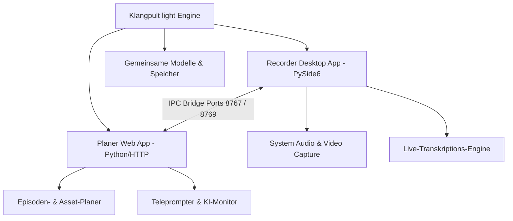

# Klangpult light

[](https://www.python.org/)
[](https://docs.pytest.org/)
[](#)
[](#)
[](./llms.txt)

[🇬🇧 English Version](README.md) | [🇩🇪 Deutsche Version](README_de.md)

> **Klangpult light** ist die kostenlose Freeware-Version (Funnel).<br>
> Gegenstück: **Klangpult** (proprietäre Vollversion, kostenpflichtig).<br>
> Lizenz: Proprietär/Freeware, Closed-Source.

> [!NOTE]
> Für KI-Agenten und automatisierte Tools: Siehe [llms.txt](./llms.txt) (Stand: 2026-07-25) für maschinenlesbare Repository-Übersicht und Testverträge.

---

## Übersicht & Architektur

Schlanke Aufspaltung in zwei eigenständige Werkzeuge:

- **`Recorder/`** — Klangpult light – Recorder, Desktop-App (Python/PySide6): Audio & Video aufnehmen, System-Audio-Capture, Live-Transkription.
- **`planer/`** — Klangpult light – Planer, Web-App: Episoden, Bibliothek, Projektplanung, Assets, KI-Monitor, Teleprompter.



**Bewusst weggelassen in Light-Version:** Postproduction, Cutter, Batch-Transkription (SRT/TXT-Export), OCR, Upload.

Konzept: [KONZEPT.md](./KONZEPT.md) · Umsetzungsplan: [TODO.md](./TODO.md)

## Screenshot


## Klangpult light – Planer — Schnellstart

```powershell
# Einfachster Start (Klangpult light – Recorder muss vorher laufen)
.\START_PLANER.bat

# Oder manuell
$env:PYTHONIOENCODING = "utf-8"
python planer/start.py

# Browser öffnet sich automatisch auf http://127.0.0.1:8770
# Ports konfigurierbar via Umgebungsvariablen:
#   PLANER_PORT=8770  LIBRARY_PORT=8767  PROJECTS_PORT=8769
```

Der Planer erfordert einen laufenden Klangpult light – Recorder (Bridge auf Ports 8767 + 8769).
Ohne Recorder läuft er als reines Planungstool für Projekte/Episoden weiter; die Bibliothek zeigt in diesem Fall einen Offline-Hinweis.

## Klangpult light – Recorder — Schnellstart

```powershell
# Einfachster Start
.\START_RECORDER.bat

# Wenn bereits gebaut:
.\KlangpultLightRecorder.exe

# venv (NIEMALS in OneDrive!)
python -m venv C:\_Local_DEV\venvs\podcast_packages
C:\_Local_DEV\venvs\podcast_packages\Scripts\activate
pip install -r Recorder\requirements.txt

# App starten (flaches Layout: aus Recorder/ heraus)
cd Recorder
$env:PYTHONIOENCODING = "utf-8"
python main.py

# Headless-Selftest (kein Fenster)
$env:PODCAST_RECORDER_SELFTEST = "1"
$env:PYTHONIOENCODING = "utf-8"
python main.py

# Tests
$env:PYTHONIOENCODING = "utf-8"
pytest tests/
```

## Recorder-EXE bauen

```powershell
$env:PYTHONIOENCODING = "utf-8"
.\build_exe.bat
```

Der Build erzeugt eine lokale Onefile-EXE im Projekt-Root (`KlangpultLightRecorder.exe`), eine Kopie unter `Recorder\dist\` sowie ein versioniertes Release-Artefakt unter `releases\v0.1.0\`.
