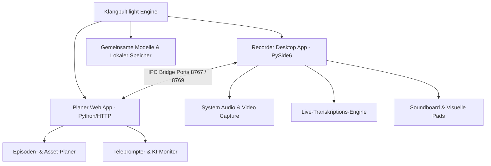
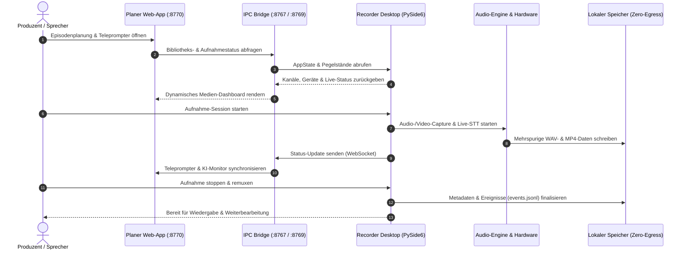

# Klangpult light

**Status: Öffentliche Alpha** — Schlanke, lokale Desktop- und Web-Workstation für Podcasts, Multimedia-Aufnahmen und Medienplanung.

[](#)
[](./CHANGELOG.md)
[](https://www.python.org/)
[-success.svg)](https://docs.pytest.org/)
[](https://github.com/entertain-and-more/KlangpultLight/actions/workflows/ci.yml)
[](#)
[](./LICENSE)
[](./NOTICE)
[](./SECURITY.md)
[-green.svg)](./SECURITY.md)
[](./SECURITY.md)
[--Dynamisch-green.svg)](./THIRD_PARTY_LICENSES.md)
[-blue.svg)](./MARKETING-LOG.txt)
[](https://github.com/astral-sh/ruff)
[](https://github.com/entertain-and-more)
[](https://github.com/open-bricks/open-bricks)
[](./llms.txt)

[🇬🇧 English Version](README.md) | [🇩🇪 Deutsche Version](README_de.md) | [🇪🇸 Versión en español](README.es.md)

> **Klangpult light** ist die kostenlose Freeware-Version (Funnel).<br>
> Gegenstück: **Klangpult** (proprietäre Vollversion mit automatischem Multichannel-Cutter, Batch-Export und OCR).<br>
> Lizenz: Freeware / Proprietär, Closed-Source.

> [!NOTE]
> Für KI-Agenten und automatisierte Tools: Siehe [llms.txt](./llms.txt) (Stand: 2026-09-24) für eine maschinenlesbare Repository-Übersicht und Testverträge. Formale Herkunft und Mitwirkenden-Attribution sind in [NOTICE](./NOTICE) deklariert. Vollständige Drittanbieter-Lizenzaudits und Level 1 SBOM sind in [THIRD_PARTY_LICENSES.md](./THIRD_PARTY_LICENSES.md) dokumentiert, und Marketing-, SEO- und Asset-Dokumentation wird in [MARKETING-LOG.txt](./MARKETING-LOG.txt) geführt.

---

## Schnellnavigation

1. [Übersicht & Kernfähigkeiten](#übersicht--kernfähigkeiten)
2. [Systemarchitektur-Ablaufdiagramm](#systemarchitektur-ablaufdiagramm)
3. [Medien- & Aufnahme-Lebenszyklus](#medien---aufnahme-lebenszyklus)
4. [Governance- & Laufzeit-Invarianten](#governance---laufzeit-invarianten)
5. [Zielgruppen & Auffindbarkeit](#zielgruppen--auffindbarkeit)
6. [Vergleichsmatrix gegenüber Alternativen](#vergleichsmatrix-gegenüber-alternativen)
7. [Hauptfunktionen](#hauptfunktionen)
8. [UI-Vorschau & Screenshots](#ui-vorschau--screenshots)
9. [Klangpult light – Planer Schnellstart](#klangpult-light--planer-schnellstart)
10. [Klangpult light – Recorder Schnellstart](#klangpult-light--recorder-schnellstart)
11. [Standalone-EXE erstellen](#standalone-exe-erstellen)
12. [Geschwister-Ökosystem & Werkzeug-Matrix](#geschwister-ökosystem--werkzeug-matrix)
13. [Editionen-Vergleich: Light vs. Vollversion](#editionen-vergleich-light-vs-vollversion)
14. [Drittanbieter-Lizenzen, Level 1 SBOM & Transparenz](#drittanbieter-lizenzen--transparenz)
15. [Validierungs- & Verifikations-Gates](#validierungs---verifikations-gates)
16. [Sicherheitsrichtlinie & Triage-SLA](#sicherheitsrichtlinie--triage-sla)
17. [Freeware-Lizenzvereinbarung & Open-Source-Attribution](#lizenz--autor)
18. [Gesetzlicher Haftungsausschluss (§ 521 BGB) & Haftungsbeschränkung](#gesetzlicher-haftungsausschluss--521-bgb--haftungsbeschraenkung)

---

<a id="sec-01"></a><a id="übersicht--kernfähigkeiten"></a>
## Übersicht & Kernfähigkeiten

Klangpult light trennt Aufnahmebetrieb und redaktionelle Projektplanung in zwei spezialisierte Werkzeuge:

- **`Recorder/`** — **Klangpult light – Recorder**, Desktop-App (Python / PySide6): Mehrspurige Audioaufnahmen, WASAPI/MME-Loopback-Capture für System-Audio, Videosynchronisation mit FFmpeg-Muxing, Live-Soundboard-Pads und Live-Sprach-zu-Text-Transkription.
- **`planer/`** — **Klangpult light – Planer**, Web-App (Python HTTP / Vanilla JS): Episodenverwaltung, Asset-Verfolgung, Projektzeitpläne, Teleprompter-Engine und KI-Monitor.

Beide Werkzeuge kommunizieren über lokale Loopback-IPC-Sockets (`127.0.0.1:8767` und `127.0.0.1:8769`), was 100% Offline-Isolation ohne jeden Cloud-Abfluss sicherstellt.

---

<a id="sec-02"></a><a id="systemarchitektur-ablaufdiagramm"></a>
## Systemarchitektur-Ablaufdiagramm



---

<a id="sec-03"></a><a id="medien---aufnahme-lebenszyklus"></a>
## Medien- & Aufnahme-Lebenszyklus



---

<a id="sec-04"></a><a id="governance---laufzeit-invarianten"></a>
## Governance- & Laufzeit-Invarianten

Klangpult light unterliegt 10 strikten Architektur- und Laufzeit-Invarianten, die Systemstabilität, Privatsphäre und plattformübergreifende Verlässlichkeit sichern:

| Invarianten-ID | Invariante | Geltungsbereich | Technische Umsetzung | Verifikations-Garantie |
|:---:|---|---|---|---|
| `INV-LOCAL-01` | **100% Local-First & Zero-Egress** | Netzwerk & Datenschutz | Audio-, Video-, Transkriptions- und Planungsdaten verbleiben strikt lokal. Null Telemetrie, Analyse-Tracker oder externe Verbindungen. | Statische Code-Audits und Loopback-Bindungsprüfungen im Testframework. |
| `INV-USER-02` | **Unprivilegierter Betrieb (RunAsInvoker)** | Prozess- & OS-Sicherheit | Läuft vollständig im Standard-Benutzermodus ohne Administrator- oder Root-Rechte. | Keine UAC-Abfragen; Standard-Benutzerverzeichnis als Datenablage. |
| `INV-IPC-03` | **Strikte Loopback-IPC-Isolation** | Interprozess-Kommunikation | IPC zwischen Desktop-Recorder und Web-Planer bindet exklusiv an `127.0.0.1` (`:8767`, `:8769`, `:8770`). | Lokale Socket-Verträge verhindern jede Freigabe ins lokale Netzwerk oder Internet. |
| `INV-SAFE-04` | **Sichere Subprozess-Grenzen** | Prozess-Isolation | FFmpeg-Muxing und Video-Capture nutzen feste Argumentvektoren (keine Shell) und Pfadprüfungen. | Schutz vor unbefugter Befehlsinjektion und Directory-Traversal. |
| `INV-BUF-05` | **Begrenzte Puffer & Audio-Integrität** | Audio-Kern | Mehrkanal-Puffer bereinigen Float-Samples gegen NaN/Inf und schreiben atomar in WAV-Dateien. | Kein Absturz bei getrennten USB-Audio-Geräten; atomarer Schreibschutz. |
| `INV-STT-06` | **Offline-STT-Degradationsgrenze** | Sprach-zu-Text | Lokale `faster-whisper`-Transkription läuft im isolierten Worker-Thread mit Fallback bei fehlenden Modelldateien. | Transkriptionsfehler blockieren weder Aufnahme noch GUI-Thread. |
| `INV-STORE-07` | **Nutzer-kontrollierte Session-Speicherung** | Speicher & Aufbewahrung | Session-Ordner, Event-Logs (`events.jsonl`) und Mediendateien gehören dem Ersteller ohne automatische Löschung. | Deterministische Dateiablage im gewählten Arbeitsbereich. |
| `INV-PLAT-08` | **Plattformübergreifende Betriebsparität** | Portabilität | Architektur, Protokolle (`v1`) und Datenmodelle verhalten sich auf Windows, Linux und macOS identisch. | CI-Matrix validiert Builds auf Ubuntu, Windows und macOS. |
| `INV-SYNC-09` | **Multi-Host- & Synchronisations-Resilienz** | Datei- & Lock-Hygiene | `.gitignore` ignoriert Sync-Konflikte (`*-conflict-*`, `*.sync-temp-*`) und Locks (`LOCK.*`, `*.lock`). | Schutz vor Git-Verschmutzung und Cloud-Sync-Konflikten bei Multi-Host-Einsatz. |
| `INV-SLA-10` | **48h Antwort- & 5-Tage-Triage-SLA** | Sicherheits-Governance | Koordinierte Offenlegung mit Empfangsbestätigung binnen 48h und qualifizierter Triage binnen 5 Werktagen. | Verbindlich in `SECURITY.md` über `security@open-bricks.org` und `security@ellmos.ai`. |

---

<a id="sec-05"></a><a id="zielgruppen--auffindbarkeit"></a>
## Zielgruppen & Auffindbarkeit

Klangpult light ist für Kreative, Audioproduzenten und Entwickler konzipiert, die Wert auf Performance, Audioqualität und kompromisslosen Datenschutz legen:

### Zielgruppen (Personas)

- **[PERSONA-01] Podcast-Hosts, Sprecher & Hörspiel-Produzenten:** Solo-Podcaster, Voiceover-Künstler, Hörspiel-Autoren und Interviewer, die zuverlässige Mehrspuraufnahmen ohne monatliche Cloud-Gebühren, Upload-Verzögerungen oder Vendor-Lock-in benötigen.
- **[PERSONA-02] Datenschutzbewusste Streamer & Video-Produzenten:** Software-Trainer, Tutorial-Ersteller und Streamer, die lokale Bildschirm- und System-Audioaufnahmen (WASAPI Loopback) ohne Telemetrie und mit garantierter Datensouveränität durchführen.
- **[PERSONA-03] Event-Planer, Content-Strategen & Teleprompter-Bediener:** Medienproduzenten und Webinar-Leiter, die Ablaufpläne, Sponsoren-Einspieler und Sprechernotizen über einen browserbasierten Teleprompter synchron mit dem Desktop-Recorder steuern.
- **[PERSONA-04] Modulare Tool-Entwickler & Multi-Agenten-Pioniere:** Software-Ingenieure und KI-Agenten-Entwickler, die automatisierte Podcast-Workflows, lokale Transkriptions-Pipelines und Mediendienste über Loopback-Sockets und Headless-Test-Hooks integrieren.

### Suchbegriffe mit hoher Absicht (SEO & Discoverability)

- `Lokales Podcast Aufnahmeprogramm Python PySide6 ohne Cloud`
- `Mehrspur Audio Recorder mit System-Sound Loopback Aufnahme`
- `Offline Teleprompter und Episodenplaner für Video und Podcast`
- `Soundboard und Sprachaufnahme Desktop App Open Source`
- `Datenschutzfreundliche Audioaufnahme mit lokaler Transkription`
- `PySide6 Desktop Workstation für Sprecher und Content Creator`
- `Kostenlose Freeware Podcast Studio Software Windows`
- `FFmpeg Bildschirmaufnahme und Mikrofon Synchronisation lokal`

---

<a id="sec-06"></a><a id="vergleichsmatrix-gegenüber-alternativen"></a>
## Vergleichsmatrix gegenüber Alternativen

Klangpult light bietet eine spezialisierte, lokale Workstation mit synchroner Desktop-Aufnahme und Browser-Planung im direkten Vergleich zu cloud-basierten Plattformen und herkömmlichen Werkzeugen:

| Technische Dimension | Governance-Invariante | Klangpult light | Audacity (Desktop Audio-Editor) | OBS Studio (Broadcasting Suite) | Riverside.fm / Descript (Cloud SaaS) | Ad-Hoc Skripte / Sprachmemos (OS Tools) |
|:---|:---:|:---:|:---:|:---:|:---:|:---:|
| **1. Offline-First & Zero Egress** | `INV-LOCAL-01` | **100% Offline (Lokale Festplatte, null Analytik, null externe Netzwerkverbindungen)** | Hoch (Lokale Desktop-App mit optionalem Absturzbericht) | Hoch (Lokale Streaming-Software, ausgehend bei Stream) | Keine (Zwingender Cloud-Upload, Browser SaaS-Speicher) | Hoch (Standard-Dateien des Betriebssystems) |
| **2. Unprivilegierter Betrieb** | `INV-USER-02` | **Strikter RunAsInvoker-Modus (Keine Root-/Admin-Rechte erforderlich)** | Standard-Benutzerausführung | Standard-Benutzer (evtl. Treiber-Elevation für virtuelle Kamera) | Browser-Sandbox | Integrierte Standard-App |
| **3. Integrierter Web-Planer & Teleprompter** | `INV-DUAL-03` | **Integrierter Browser-Planer & Teleprompter (`planer/`) via Loopback-IPC** | Keine (Reines Aufnahmeprogramm, erfordert externes Dokument) | Keine (Erfordert Drittanbieter-Browserquellen/Docks) | Teilweise (Skriptbearbeitung innerhalb des Cloud-Editors) | Keine (Manuelles Notepad / Papier) |
| **4. Loopback-IPC & Netzwerk-Isolation** | `INV-IPC-04` | **Strikte 127.0.0.1-Bindung (Ports 8767, 8769, 8770)** | Keine (Keine Interprozess-API) | Websocket-Plugin (OBS-WebSocket im LAN) | Cloud-WebSocket-Server über öffentliches Internet | Keine |
| **5. Mehrspur- & Puffer-Integrität** | `INV-BUF-05` | **Mehrkanal-Audio mit NaN/Inf-Bereinigung & atomarem WAV-Flush** | Mehrspur-WAV-Aufnahme | Mehrspur-Audio in MKV/MP4-Containern | Cloud-aufgezeichnetes Mehrspur-Audio | Einfache Mono-/Stereo-Aufnahme |
| **6. Offline-STT-Degradationsgrenze** | `INV-STT-06` | **Isolierter lokaler Whisper-Worker (Sanfter Fallback ohne UI-Blockade)** | Plugin-abhängig (OpenVINO / Whisper-Plugins) | Drittanbieter-Plugin (OBS-Untertitel-Plugins) | Reine Cloud-Transkriptions-API | Keine |
| **7. Nutzer-kontrollierte Session-Ablage** | `INV-STORE-07` | **Eigener Arbeitsbereich mit strukturiertem events.jsonl & ohne Auto-Löschung** | Lokale Projektdateien (`.aup3`) | Lokaler Aufnahmeordner | Cloud-gehostete Aufnahmen mit Speicherplatzkontingenten | Standard-Ordner Dokumente/Aufnahmen |
| **8. Plattformübergreifende Betriebsparität** | `INV-PLAT-08` | **Einheitliche Architektur & Protokoll-Schemas (Windows, Linux, macOS)** | Multi-Plattform-Desktop-Support | Multi-Plattform-Desktop-Support | Webbrowser plattformübergreifend | Betriebssystemspezifische Apps |
| **9. Multi-Host- & Synchronisations-Resilienz** | `INV-SYNC-09` | **Gehärtetes .gitignore gegen Sync-Konflikte & Multi-Agenten-Locks** | Standard-Gitignore (falls Entwickler-Klon) | Standard-Gitignore | Nicht zutreffend (Cloud-gehostet) | Keine |
| **10. Sicherheits-SLA & Multi-OS CI** | `INV-SLA-10` | **48h Antwort-SLA / 5d Triage + GitHub Actions CI (Ubuntu, Windows, macOS)** | Community-Bugtracker | Community GitHub Issues | Kommerzielles Support-Ticketsystem | Support des OS-Herstellers |

---

<a id="sec-07"></a><a id="hauptfunktionen"></a>
## Hauptfunktionen

- 🎙️ **Mehrspur-Audioaufnahme**: Separate Kanäle für Mikrofoneingang, System-Audio-Capture und Soundboard-Einspieler.
- 📹 **Synchrone Videoaufzeichnung**: Bildsignal wird synchron zum Ton aufgezeichnet und via FFmpeg zu MP4 gemuxt.
- ⚡ **Live-Soundboard & Einspieler-Pads**: Audioschnipsel und Hintergrundmusiken während der Sendung direkt abfeuern.
- 📝 **Echtzeit-Sprach-zu-Text (STT)**: Lokale Live-Transkription zur direkten Textüberwachung ohne Cloud-Zwang.
- 📜 **Integrierter Teleprompter**: Stufenlos steuerbarer Teleprompter direkt in der Browseroberfläche des Planers.
- 🔒 **100% Local-First & Zero-Egress**: Alle Audio-, Video- und Planungsdaten bleiben stets auf Ihrem Rechner.

---

<a id="sec-08"></a><a id="ui-vorschau--screenshots"></a>
## UI-Vorschau & Screenshots


---

<a id="sec-09"></a><a id="klangpult-light--planer-schnellstart"></a>
## Klangpult light – Planer Schnellstart

```powershell
# Einfachster Start (Klangpult light – Recorder sollte vorher laufen)
.\START_PLANER.bat

# Oder manuell:
$env:PYTHONIOENCODING = "utf-8"
python planer/start.py

# Browser öffnet sich automatisch auf http://127.0.0.1:8770
# Konfigurierbare Ports via Umgebungsvariablen:
#   PLANER_PORT=8770  LIBRARY_PORT=8767  PROJECTS_PORT=8769
```

Der Planer verbindet sich über die IPC-Bridge auf den Ports `8767` und `8769` mit dem laufenden Recorder.
Läuft der Recorder nicht, arbeitet der Planer im Standalone-Modus für Offline-Projekt- und Episodenplanung.

---

<a id="sec-10"></a><a id="klangpult-light--recorder-schnellstart"></a>
## Klangpult light – Recorder Schnellstart

```powershell
# Einfachster Start
.\START_RECORDER.bat

# Wenn die Standalone-EXE bereits gebaut wurde:
.\KlangpultLightRecorder.exe

# Virtuelle Umgebung einrichten:
python -m venv C:\_Local_DEV\venvs\podcast_packages
C:\_Local_DEV\venvs\podcast_packages\Scripts\activate
pip install -r Recorder\requirements.txt

# Desktop-Applikation starten:
cd Recorder
$env:PYTHONIOENCODING = "utf-8"
python main.py

# Headless-Selbsttest (ohne grafisches Fenster):
$env:PODCAST_RECORDER_SELFTEST = "1"
$env:PYTHONIOENCODING = "utf-8"
python main.py

# Testsuite ausführen:
$env:PYTHONIOENCODING = "utf-8"
pytest
```

---

<a id="sec-11"></a><a id="standalone-exe-erstellen"></a>
## Standalone-EXE erstellen

```powershell
$env:PYTHONIOENCODING = "utf-8"
.\build_exe.bat
```

Das Build-Skript erzeugt eine eigenständige Onefile-EXE im Projektstamm (`KlangpultLightRecorder.exe`), eine Build-Kopie in `Recorder\dist\` und ein versioniertes Release-Paket unter `releases\v0.1.0\`.

---

<a id="sec-12"></a><a id="geschwister-ökosystem--werkzeug-matrix"></a>
## Geschwister-Ökosystem & Werkzeug-Matrix

Klangpult light ist Teil der **entertain-and-more** Produktlinie und des übergreifenden **open-bricks** Entwicklungsnetzwerks:

| Projekt | Organisation | Fokus / Kategorie | Status |
|---|---|---|---|
| [BattleStage](https://github.com/entertain-and-more/BattleStage) | entertain-and-more | Serverautoritativer 2D/3D-Platform-Fighter | Aktiv |
| [ChainReaction](https://github.com/entertain-and-more/ChainReaction) | entertain-and-more | Dynamisches Physik- & Kettenreaktionsspiel | Aktiv |
| [StreetRacer](https://github.com/entertain-and-more/StreetRacer) | entertain-and-more | High-Speed Arcade-Rennspiel | Aktiv |
| [RealmWars](https://github.com/entertain-and-more/RealmWars) | entertain-and-more | Taktische Strategie & Königreich-Verteidigung | Aktiv |
| [GhostTrain](https://github.com/entertain-and-more/GhostTrain) | entertain-and-more | Atmosphärisches Abenteuer & Rätsel | Aktiv |
| [RescueMe](https://github.com/entertain-and-more/RescueMe) | entertain-and-more | Schnelle Notfalleinsatz-Simulation | Aktiv |
| [HauntedHouse](https://github.com/entertain-and-more/HauntedHouse) | entertain-and-more | Interaktive Gruselvilla-Erkundung | Aktiv |
| [MafiaCastle](https://github.com/entertain-and-more/MafiaCastle) | entertain-and-more | Mehrspieler Social-Deduction | Aktiv |
| [CuteStrike](https://github.com/entertain-and-more/CuteStrike) | entertain-and-more | Humorvolle Familien-Action-Arena | Aktiv |
| [BattleChess3D](https://github.com/entertain-and-more/BattleChess3D) | entertain-and-more | Animiertes 3D-Schachtaktikspiel | Aktiv |
| [system-auditor](https://github.com/ellmos-ai/system-auditor) | ellmos-ai | Lokaler System-Audit- & Gesundheitsprüfer | Aktiv |
| [automation-master](https://github.com/dev-bricks/automation-master) | dev-bricks | Event-Sourcing Automations-Governance | Aktiv |
| [ExplorerPro](https://github.com/file-bricks/ExplorerPro) | file-bricks | Hochperformanter lokaler Datei-Explorer | Aktiv |
| [CleanMarkdown](https://github.com/doc-bricks/CleanMarkdown) | doc-bricks | Deterministische Markdown-Bereinigung | Aktiv |
| [ellmos-voice-io](https://github.com/ellmos-ai/ellmos-voice-io) | ellmos-ai | Zero-Egress Audio- & Sprachgrundlage | Aktiv |
| [WikiStub-Seed](https://github.com/dev-bricks/WikiStub-Seed) | dev-bricks | Mehrsprachige Offline-Wissens-Seeds | Aktiv |
| [open-bricks](https://github.com/open-bricks/open-bricks) | open-bricks | Dach-Ökosystem für offene Software-Module | Aktiv |

---

<a id="sec-13"></a><a id="editionen-vergleich-light-vs-vollversion"></a>
## Editionen-Vergleich: Light vs. Vollversion

| Funktion | Klangpult light (Freeware) | Klangpult (Vollversion) |
|---|:---:|:---:|
| Mehrspur-Audioaufnahme | ✅ | ✅ |
| System-Audio-Capture (Loopback) | ✅ | ✅ |
| Synchrone Videoaufzeichnung | ✅ | ✅ |
| Soundboard- & Medien-Pads | ✅ | ✅ |
| Live-Transkriptions-Monitor | ✅ | ✅ |
| Web-Planer & Teleprompter | ✅ | ✅ |
| Automatischer Mehrspur-Cutter | ❌ | ✅ |
| Batch-Transkriptionsexport (SRT/TXT) | ❌ | ✅ |
| Automatischer Video-OCR-Scanner | ❌ | ✅ |
| Professionelles Mastering & Postproduction | ❌ | ✅ |

Konzept: [KONZEPT.md](./KONZEPT.md) · Umsetzungsplan: [TODO.md](./TODO.md) · Versionshistorie: [CHANGELOG.md](./CHANGELOG.md)

---

<a id="sec-14"></a><a id="drittanbieter-lizenzen--transparenz"></a><a id="drittanbieter-lizenzen-level-1-sbom--transparenz"></a>
## Drittanbieter-Lizenzen, Level 1 SBOM & Transparenz

Klangpult light wird als kostenlose Freeware-Anwendung unter der [Klangpult light Freeware-Lizenzvereinbarung](LICENSE) bereitgestellt.

Alle eingebundenen Laufzeitbibliotheken und Entwicklungswerkzeuge unterliegen anerkannten, permissiven und freien Open-Source-Lizenzen:
- **PySide6 (Qt6 Python-Bindings)**: Lizenziert unter **LGPL-3.0**. PySide6 wird ausschließlich über dynamische Bindung (Dynamic Linking) genutzt. In voller Übereinstimmung mit **LGPLv3 § 4** steht es Nutzern frei, die Qt/PySide6-Bibliotheken zu inspizieren, zu modifizieren und dynamisch neu zu verknüpfen.
- **Audio- & Medien-Stack**: `sounddevice` (MIT), `soundfile` (BSD-3-Clause), `numpy` (BSD-3-Clause), `mss` (MIT), `websockets` (BSD-3-Clause), `jsonschema` (MIT), `opencv-python` (Apache-2.0).
- **Subprozess-Isolation**: Externe Binärprogramme wie FFmpeg werden ausschließlich über isolierte Subprozess-Grenzen mit festen, geprüften Argumentvektoren aufgerufen.
- **Zero-Copyleft-Garantie**: Aufnahmen von Nutzern (WAV, MP4), Soundboard-Dateien, Teleprompter-Skripte und Episodendaten verbleiben zu 100% Eigentum des Erstellers und unterliegen keinem Copyleft oder Lizenzzwang.

Detaillierte Abhängigkeitsmatrizen, die Level 1 SBOM Invarianten-Kreuzreferenzmatrix, vollständige Lizenztexte und Konformitätshinweise finden Sie in [THIRD_PARTY_LICENSES.md](./THIRD_PARTY_LICENSES.md).

---

<a id="sec-15"></a><a id="validierungs---verifikations-gates"></a>
## Validierungs- & Verifikations-Gates

Qualität, Stabilität und Vertragstreue werden durch automatisierte Prüfgates abgesichert:

```powershell
# 1. Metadaten- & strukturelle Vertragstests
$env:PYTHONIOENCODING = "utf-8"
pytest tests/test_metadata.py

# 2. Planer statische & Barrierefreiheits-Prüfung
pytest tests/test_planer_accessibility_static.py

# 3. Recorder Desktop- & Audio-Kern-Testsuite (440 Tests)
pytest Recorder/tests/

# 4. Gesamte Pytest-Suite (521 Tests: 521 bestanden)
pytest

# 5. Code-Stil- & Linter-Prüfung
ruff check .

# 6. Bytecode-Kompilierungsgate
python -m compileall -q .

# 7. Headless-Selbsttest der Desktop-Anwendung
$env:PODCAST_RECORDER_SELFTEST = "1"
python Recorder/main.py

# 8. Git-Diff- & Whitespace-Verifikation
git diff --check
```

---

<a id="sec-16"></a><a id="sicherheitsrichtlinie--triage-sla"></a>
## Sicherheitsrichtlinie & Triage-SLA

Wir garantieren strenge Sicherheits- und Privatsphäre-Standards:

- **Null Datenabfluss (Zero Cloud Egress)**: Aufnahmen und Projektdaten werden niemals auf externe Server hochgeladen.
- **Loopback-Isolation**: Lokale Netzwerkdienste binden strikt an `127.0.0.1`.
- **48-Stunden Reaktions-SLA**: Bestätigung des Eingangs innerhalb von 48 Stunden.
- **5-Werktage Triage-SLA**: Verbindliche qualifizierte Triage-Bewertung binnen 5 Werktagen.
- **Sicherheitskontakte**: [security@open-bricks.org](mailto:security@open-bricks.org), [security@ellmos.ai](mailto:security@ellmos.ai) und [support@lukasgeiger.com](mailto:support@lukasgeiger.com).
- **GitHub Security Advisories**: Schwachstellen vertraulich melden via [GitHub Security Advisories](https://github.com/entertain-and-more/KlangpultLight/security/advisories/new).
- **Bilinguale Sicherheitsrichtlinie**: Detaillierte Richtlinien finden Sie in [SECURITY.md](./SECURITY.md).

---

<a id="sec-17"></a><a id="lizenz--autor"></a><a id="freeware-lizenzvereinbarung--open-source-attribution"></a>
## Freeware-Lizenzvereinbarung & Open-Source-Attribution

Klangpult light steht unter einer **Freeware / Closed-Source Proprietären Lizenz**. Vollständige Lizenzbedingungen: [LICENSE](./LICENSE).<br>
Formale Ökosystem-Attribution, Urheber- und Mitwirkenden-Anerkennung sind in [NOTICE](./NOTICE) hinterlegt.<br>
Copyright (c) 2026 Lukas Geiger, entertain-and-more. Alle Rechte vorbehalten.

---

<a id="sec-18"></a><a id="gesetzlicher-haftungsausschluss--521-bgb--haftungsbeschraenkung"></a>
## Gesetzlicher Haftungsausschluss (§ 521 BGB) & Haftungsbeschränkung

### Gesetzlicher Haftungsausschluss (§ 521 BGB Gefälligkeitsrecht) & Haftungsbeschränkung
Die Bereitstellung dieser Software und der zugehörigen Dokumentation erfolgt unentgeltlich. Gemäß dem gesetzlichen Haftungsregime des deutschen Bürgerlichen Gesetzbuches für unentgeltliche Zuwendungen und Gefälligkeiten (**§ 521 BGB** — *Haftung des Schenkers*) ist die Haftung für Sach- und Rechtsmängel auf **Vorsatz und grobe Fahrlässigkeit** beschränkt. Jegliche weitergehende gesetzliche Gewährleistung oder deliktische Haftung für einfache oder leichte Fahrlässigkeit ist im gesetzlich maximal zulässigen Umfang ausdrücklich ausgeschlossen.

### Ökosystem-Zugehörigkeit & SLAs
- **Dachstruktur**: Entwickelt unter dem Dach des [open-bricks](https://github.com/open-bricks/open-bricks) Ökosystems und gepflegt innerhalb der [entertain-and-more](https://github.com/entertain-and-more) Produktlinie.
- **Reaktionsversprechen**: Vertrauliche Sicherheitsmeldungen via [SECURITY.md](./SECURITY.md) erhalten eine bestätigte Rückmeldung innerhalb von 48 Stunden und eine qualifizierte Triage-Bewertung binnen 5 Werktagen.
