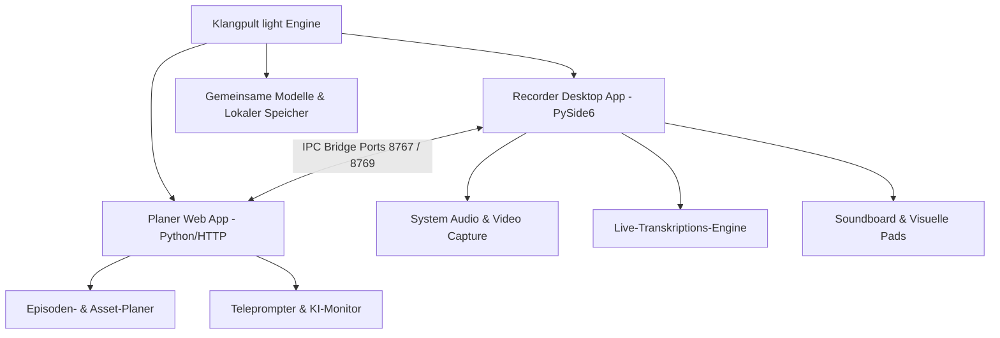
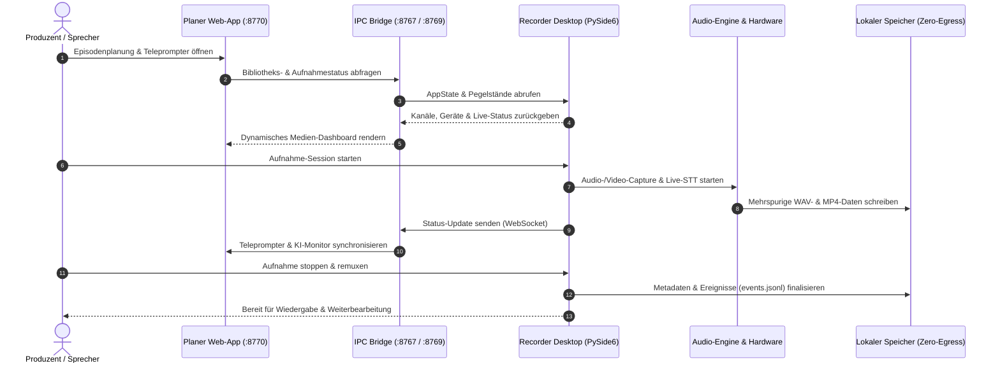

# Klangpult light

**Status: Öffentliche Alpha** — Schlanke, lokale Desktop- und Web-Workstation für Podcasts, Multimedia-Aufnahmen und Medienplanung.

[](#)
[](https://www.python.org/)
[-success.svg)](https://docs.pytest.org/)
[](https://github.com/entertain-and-more/KlangpultLight/actions/workflows/ci.yml)
[](./LICENSE)
[](./SECURITY.md)
[](https://github.com/entertain-and-more)
[](https://github.com/open-bricks/open-bricks)
[](./SECURITY.md)
[](./llms.txt)

[🇬🇧 English Version](README.md) | [🇩🇪 Deutsche Version](README_de.md)

> **Klangpult light** ist die kostenlose Freeware-Version (Funnel).<br>
> Gegenstück: **Klangpult** (proprietäre Vollversion mit automatischem Multichannel-Cutter, Batch-Export und OCR).<br>
> Lizenz: Freeware / Proprietär, Closed-Source.

> [!NOTE]
> Für KI-Agenten und automatisierte Tools: Siehe [llms.txt](./llms.txt) (Stand: 2026-08-22) für maschinenlesbare Repository-Übersicht und Testverträge.

---

## Schnellnavigation

- [Übersicht & Architektur](#übersicht--architektur)
- [System-Lebenszyklus & Sequenzablauf](#system-lebenszyklus--sequenzablauf)
- [Screenshot & Benutzeroberfläche](#screenshot--benutzeroberfläche)
- [Hauptfunktionen](#hauptfunktionen)
- [Klangpult light – Planer — Schnellstart](#klangpult-light--planer--schnellstart)
- [Klangpult light – Recorder — Schnellstart](#klangpult-light--recorder--schnellstart)
- [Recorder-EXE bauen](#recorder-exe-bauen)
- [Geschwister-Ökosystem](#geschwister-ökosystem)
- [Sicherheit & Datenschutz](#sicherheit--datenschutz)
- [Vergleich: Light vs. Vollversion](#vergleich-light-vs-vollversion)
- [Lizenz](#lizenz)

---

## Übersicht & Architektur

Klangpult light trennt Aufnahmebetrieb und redaktionelle Projektplanung in zwei spezialisierte Werkzeuge:

- **`Recorder/`** — Klangpult light – Recorder, Desktop-App (Python / PySide6): Mehrspurige Audioaufnahmen, WASAPI/MME-Loopback-Capture für System-Audio, Videosynchronisation mit FFmpeg-Muxing, Live-Soundboard-Pads und Live-Sprach-zu-Text-Transkription.
- **`planer/`** — Klangpult light – Planer, Web-App: Episodenverwaltung, Asset-Verfolgung, Projektzeitpläne, Teleprompter-Engine und KI-Monitor.



---

## System-Lebenszyklus & Sequenzablauf



---

## Screenshot & Benutzeroberfläche


---

## Hauptfunktionen

- 🎙️ **Mehrspur-Audioaufnahme**: Separate Kanäle für Mikrofoneingang, System-Audio-Capture und Soundboard-Einspieler.
- 📹 **Synchrone Videoaufzeichnung**: Bildsignal wird synchron zum Ton aufgezeichnet und via FFmpeg zu MP4 gemuxt.
- ⚡ **Live-Soundboard & Einspieler-Pads**: Audioschnipsel und Hintergrundmusiken während der Sendung direkt abfeuern.
- 📝 **Echtzeit-Sprach-zu-Text (STT)**: Lokale Live-Transkription zur direkten Textüberwachung ohne Cloud-Zwang.
- 📜 **Integrierter Teleprompter**: Stufenlos steuerbarer Teleprompter direkt in der Browseroberfläche des Planers.
- 🔒 **100% Local-First & Zero-Egress**: Alle Audio-, Video- und Planungsdaten bleiben stets auf Ihrem Rechner.

---

## Klangpult light – Planer — Schnellstart

```powershell
# Einfachster Start (Klangpult light – Recorder sollte vorher laufen)
.\START_PLANER.bat

# Oder manuell:
$env:PYTHONIOENCODING = "utf-8"
python planer/start.py

# Browser öffnet sich automatisch auf http://127.0.0.1:8770
# Konfigurierbare Ports via Umgebungsvariablen:
#   PLANER_PORT=8770  LIBRARY_PORT=8767  PROJECTS_PORT=8769
```

Der Planer verbindet sich über die IPC-Bridge auf den Ports `8767` und `8769` mit dem laufenden Recorder.
Läuft der Recorder nicht, arbeitet der Planer im Standalone-Modus für Offline-Projekt- und Episodenplanung.

---

## Klangpult light – Recorder — Schnellstart

```powershell
# Einfachster Start
.\START_RECORDER.bat

# Wenn die Standalone-EXE bereits gebaut wurde:
.\KlangpultLightRecorder.exe

# Virtuelle Umgebung einrichten:
python -m venv C:\_Local_DEV\venvs\podcast_packages
C:\_Local_DEV\venvs\podcast_packages\Scripts\activate
pip install -r Recorder\requirements.txt

# Desktop-Applikation starten:
cd Recorder
$env:PYTHONIOENCODING = "utf-8"
python main.py

# Headless-Selbsttest (ohne grafisches Fenster):
$env:PODCAST_RECORDER_SELFTEST = "1"
$env:PYTHONIOENCODING = "utf-8"
python main.py

# Testsuite ausführen:
$env:PYTHONIOENCODING = "utf-8"
pytest
```

---

## Recorder-EXE bauen

```powershell
$env:PYTHONIOENCODING = "utf-8"
.\build_exe.bat
```

Das Build-Skript erzeugt eine eigenständige Onefile-EXE im Projektstamm (`KlangpultLightRecorder.exe`), eine Build-Kopie in `Recorder\dist\` und ein versioniertes Release-Paket unter `releases\v0.1.0\`.

---

## Geschwister-Ökosystem

Klangpult light ist Teil der **entertain-and-more** Produktlinie und des übergreifenden **open-bricks** Entwicklungsnetzwerks:

| Projekt | Organisation | Fokus / Kategorie | Status |
|---|---|---|---|
| [BattleStage](https://github.com/entertain-and-more/BattleStage) | entertain-and-more | Serverautoritativer 2D/3D-Platform-Fighter | Aktiv |
| [ChainReaction](https://github.com/entertain-and-more/ChainReaction) | entertain-and-more | Dynamisches Physik- & Kettenreaktionsspiel | Aktiv |
| [StreetRacer](https://github.com/entertain-and-more/StreetRacer) | entertain-and-more | High-Speed Arcade-Rennspiel | Aktiv |
| [RealmWars](https://github.com/entertain-and-more/RealmWars) | entertain-and-more | Taktische Strategie & Königreich-Verteidigung | Aktiv |
| [GhostTrain](https://github.com/entertain-and-more/GhostTrain) | entertain-and-more | Atmosphärisches Abenteuer & Rätsel | Aktiv |
| [RescueMe](https://github.com/entertain-and-more/RescueMe) | entertain-and-more | Schnelle Notfalleinsatz-Simulation | Aktiv |
| [HauntedHouse](https://github.com/entertain-and-more/HauntedHouse) | entertain-and-more | Interaktive Gruselvilla-Erkundung | Aktiv |
| [MafiaCastle](https://github.com/entertain-and-more/MafiaCastle) | entertain-and-more | Mehrspieler Social-Deduction | Aktiv |
| [CuteStrike](https://github.com/entertain-and-more/CuteStrike) | entertain-and-more | Humorvolle Familien-Action-Arena | Aktiv |
| [BattleChess3D](https://github.com/entertain-and-more/BattleChess3D) | entertain-and-more | Animiertes 3D-Schachtaktikspiel | Aktiv |
| [open-bricks](https://github.com/open-bricks/open-bricks) | open-bricks | Dach-Ökosystem für offene Software-Module | Aktiv |

---

## Sicherheit & Datenschutz

Wir garantieren strenge Sicherheits- und Privatsphäre-Standards:

- **Null Datenabfluss (Zero Cloud Egress)**: Aufnahmen und Projektdaten werden niemals auf externe Server hochgeladen.
- **Loopback-Isolation**: Lokale Netzwerkdienste binden strikt an `127.0.0.1`.
- **Bilinguale Sicherheitsrichtlinie**: Detaillierte Richtlinien und Meldewege finden Sie in [SECURITY.md](./SECURITY.md).

---

## Vergleich: Light vs. Vollversion

| Funktion | Klangpult light (Freeware) | Klangpult (Vollversion) |
|---|:---:|:---:|
| Mehrspur-Audioaufnahme | ✅ | ✅ |
| System-Audio-Capture (Loopback) | ✅ | ✅ |
| Synchrone Videoaufzeichnung | ✅ | ✅ |
| Soundboard- & Medien-Pads | ✅ | ✅ |
| Live-Transkriptions-Monitor | ✅ | ✅ |
| Web-Planer & Teleprompter | ✅ | ✅ |
| Automatischer Mehrspur-Cutter | ❌ | ✅ |
| Batch-Transkriptionsexport (SRT/TXT) | ❌ | ✅ |
| Automatischer Video-OCR-Scanner | ❌ | ✅ |
| Professionelles Mastering & Postproduction | ❌ | ✅ |

Konzept: [KONZEPT.md](./KONZEPT.md) · Umsetzungsplan: [TODO.md](./TODO.md) · Versionshistorie: [CHANGELOG.md](./CHANGELOG.md)

---

## Lizenz

Klangpult light steht unter einer **Freeware / Closed-Source Proprietären Lizenz**. Vollständige Lizenzbedingungen: [LICENSE](./LICENSE).
Copyright (c) 2026 Lukas Geiger. Alle Rechte vorbehalten.
